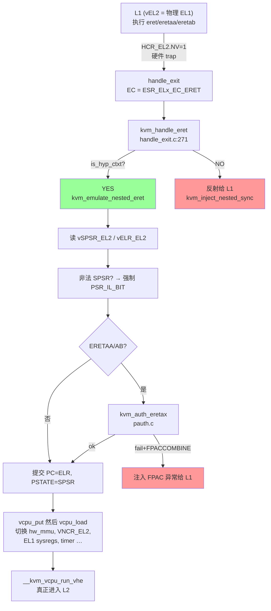
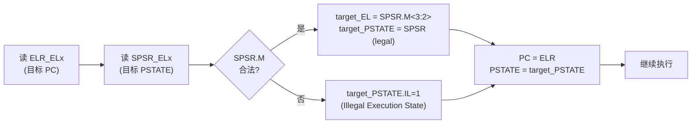
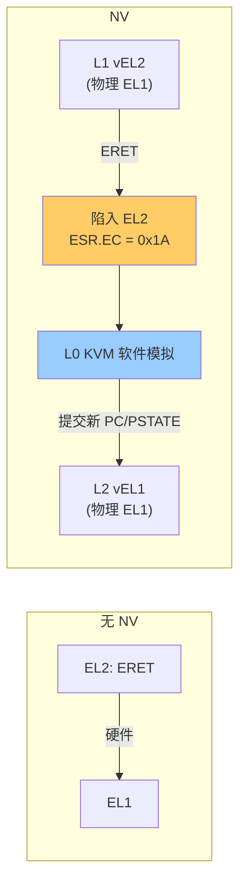
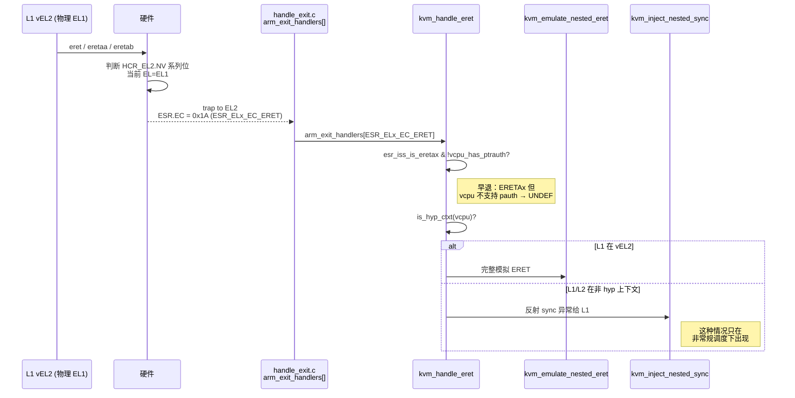
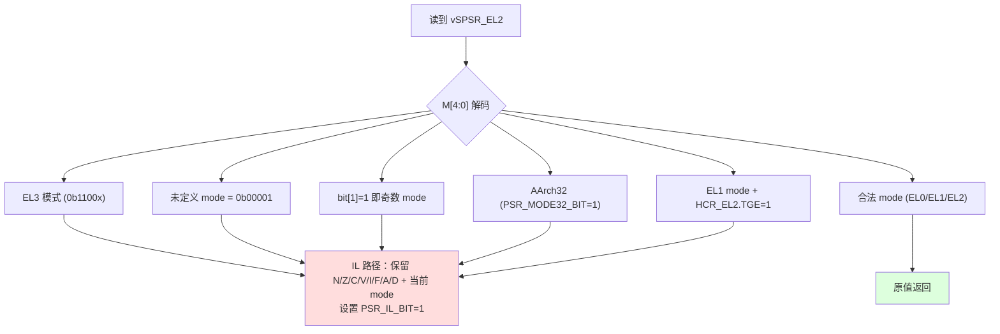
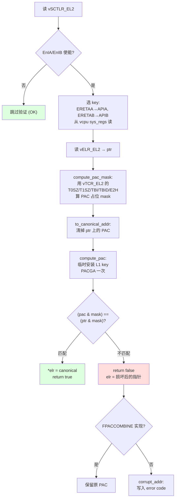
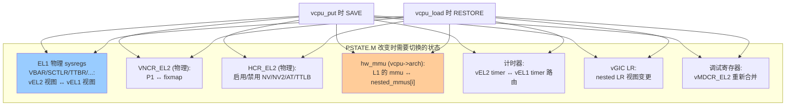
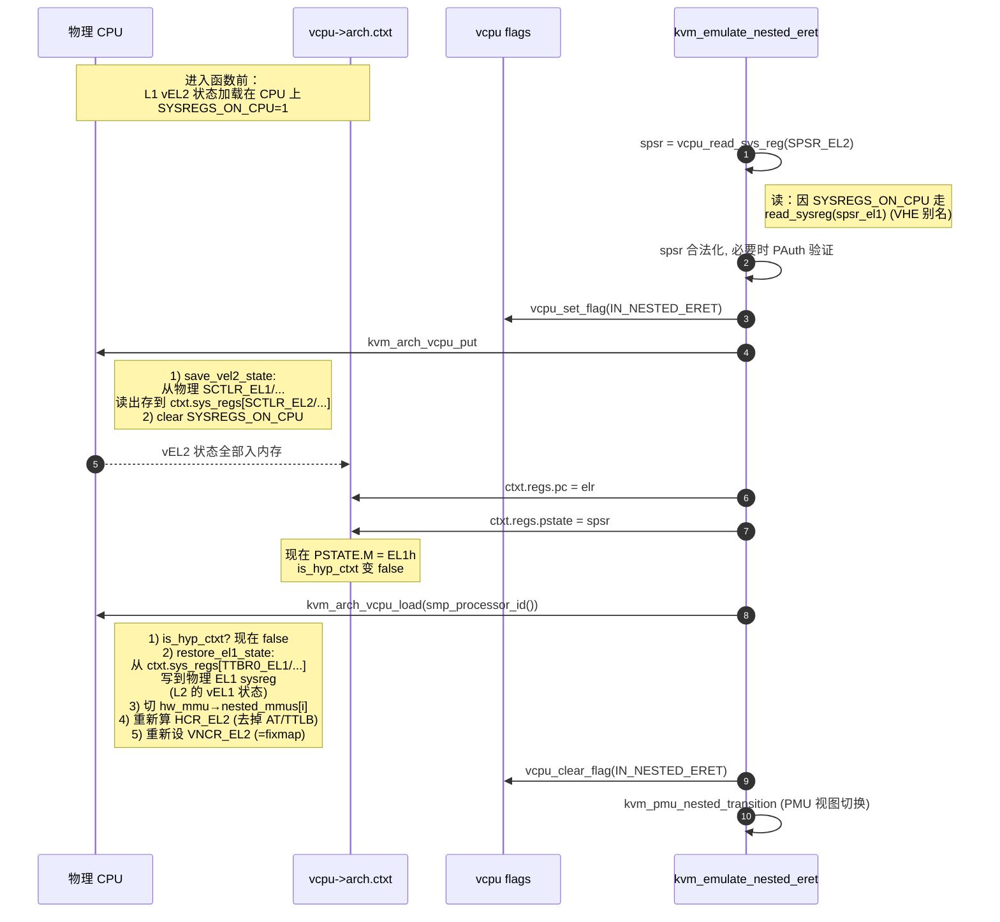
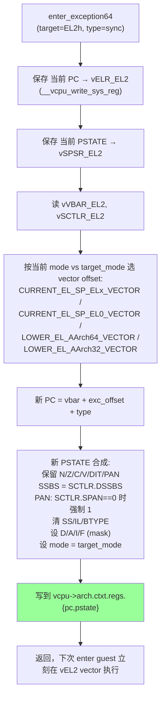
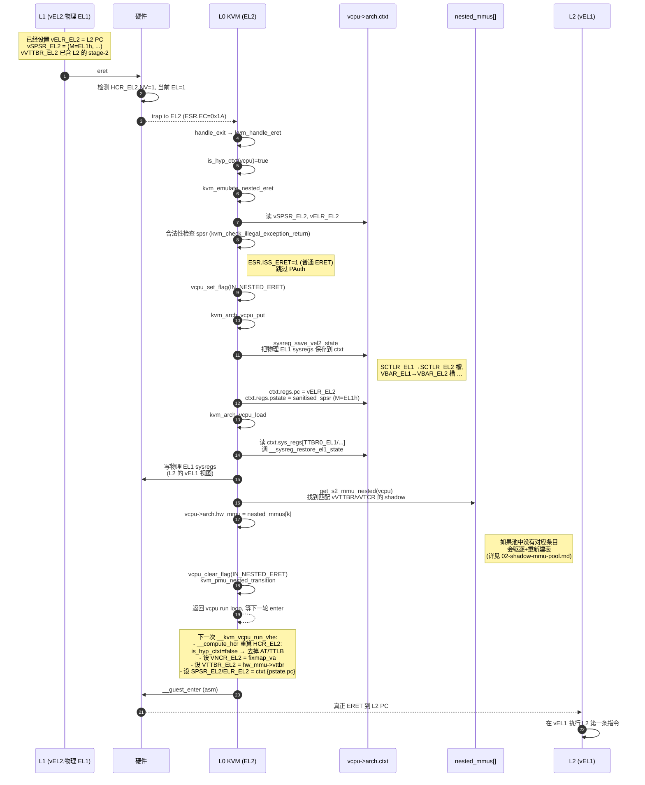

# aarch64 嵌套虚拟化 (1) —— ERET 完整模拟

> 基于 `zsdaka/linux` HEAD `8bc67e4db` (v7.1.0-rc4 era) 的 KVM/arm64 实现  
> 系列首篇 · 配套文档：`02-shadow-mmu-pool.md` · `03-nested-stage2.md` · `04-nested-vgic.md`

---

## 目录

- [aarch64 嵌套虚拟化 (1) —— ERET 完整模拟](#aarch64-嵌套虚拟化-1--eret-完整模拟)
  - [目录](#目录)
  - [0. 速读](#0-速读)
  - [1. 普通 ERET 语义（基线）](#1-普通-eret-语义基线)
  - [2. NV 下 ERET 必须 trap 的硬件原因](#2-nv-下-eret-必须-trap-的硬件原因)
  - [3. ERET 三个变种与 ESR 编码](#3-eret-三个变种与-esr-编码)
  - [4. trap 入口：`kvm_handle_eret`](#4-trap-入口kvm_handle_eret)
  - [5. 核心模拟：`kvm_emulate_nested_eret`](#5-核心模拟kvm_emulate_nested_eret)
  - [6. SPSR 合法性检查（Illegal Exception Return）](#6-spsr-合法性检查illegal-exception-return)
  - [7. ERETAA/ERETAB 的指针认证模拟](#7-eretaaeretab-的指针认证模拟)
  - [8. `vcpu_put`/`vcpu_load` 大切换的必要性](#8-vcpu_putvcpu_load-大切换的必要性)
  - [9. 反向路径：`kvm_inject_nested`（异常注入）](#9-反向路径kvm_inject_nested异常注入)
  - [10. PSTATE 合成与 `__kvm_adjust_pc`](#10-pstate-合成与-__kvm_adjust_pc)
  - [11. 完整端到端时序：L1 `eret` → L2 第一条指令](#11-完整端到端时序l1-eret--l2-第一条指令)
  - [12. 边界与限制](#12-边界与限制)
  - [13. 速查卡](#13-速查卡)
  - [附录 A：ARM 文档与本文术语对照](#附录-aarm-文档与本文术语对照)

---

## 0. 速读



ERET 模拟的本质是：**让 KVM 软件做硬件原本会做的事**（读 ELR/SPSR、合法性检查、PAuth、提交 PC/PSTATE），并且因为这次"返回"实际上跨越了一个 vCPU 模式（vEL2→vEL1），KVM 必须通过 `vcpu_put`+`vcpu_load` 来切换整套依赖于"当前模式"的硬件状态（影子 stage-2 MMU、VNCR_EL2、计时器…）。

---

## 1. 普通 ERET 语义（基线）

无 NV 时，硬件执行 `ERET`（`ERETAA`/`ERETAB`）做下面这些事（参考 `arch/arm64/kvm/hyp/exception.c` 注释引用 ARM DDI 0487E.a）：



**关键点**：

- 来源：`SPSR_EL2`（vEL2 的"返回 PSTATE"）+ `ELR_EL2`（vEL2 的"返回 PC"）
- 目标 EL：从 `SPSR.M[3:2]` 解码（`00`=EL0, `01`=EL1, `10`=EL2, `11`=EL3）
- 不允许"升级"：来自 EL2 的 ERET 只能去 EL2 / EL1 / EL0；非法目标 → 设置 `PSTATE.IL=1`，下一条指令将立即触发 Illegal State 异常

---

## 2. NV 下 ERET 必须 trap 的硬件原因

ARM 在 ARMv8.4 引入 `FEAT_NV` 时增加了 `HCR_EL2.NV` 控制位（位 42）。当 `HCR_EL2.{NV, NV1, NV2}` 任一为 1 且 PE 处于 EL1 时，执行 `ERET`/`ERETAA`/`ERETAB` 会**陷入 EL2**，而不是真的执行返回。

参考 [VNCR_EL2 寄存器规范（DDI 0595, lth.se 镜像）](https://www.df.lth.se/~getz/ARM/SysReg/AArch64-vncr_el2.html) 与内核中 ARM ARM 引用：

```c
/* arch/arm64/kvm/handle_exit.c:271 */
static int kvm_handle_eret(struct kvm_vcpu *vcpu)
{
    if (esr_iss_is_eretax(kvm_vcpu_get_esr(vcpu)) &&
        !vcpu_has_ptrauth(vcpu))
        return kvm_handle_ptrauth(vcpu);
    /*
     * If we got here, two possibilities:
     *
     * - the guest is in EL2, and we need to fully emulate ERET
     * - the guest is in EL1, and we need to reinject the
     *   exception into the L1 hypervisor.
     *
     * If KVM ever traps ERET for its own use, we'll have to
     * revisit this.
     */
    if (is_hyp_ctxt(vcpu))
        kvm_emulate_nested_eret(vcpu);
    else
        kvm_inject_nested_sync(vcpu, kvm_vcpu_get_esr(vcpu));
    return 1;
}
```

**为什么必须 trap？** 因为 L1 物理上跑在 EL1，但它的逻辑上下文是 vEL2。L1 的 ERET "意图"是从 vEL2 返回到 vEL1/vEL0；硬件无法理解这种 vEL 概念，只能产生异常让 L0 介入完成模拟。



---

## 3. ERET 三个变种与 ESR 编码

```c
/* arch/arm64/include/asm/esr.h:38 */
#define ESR_ELx_EC_ERET     UL(0x1a)   /* EL2 only */

/* ISS field definitions for ERET/ERETAA/ERETAB trapping */
#define ESR_ELx_ERET_ISS_ERET   0x2   /* bit 1: 1=ERET, 0=ERETAx */
#define ESR_ELx_ERET_ISS_ERETA  0x1   /* bit 0: 0=A-key, 1=B-key */

/* arch/arm64/include/asm/esr.h:532 */
/* Indicate whether ESR.EC==0x1A is for an ERETAx instruction */
static inline bool esr_iss_is_eretax(unsigned long esr)
{
    return esr & ESR_ELx_ERET_ISS_ERET;     /* 注意：取反逻辑 */
}

/* Indicate which key is used for ERETAx (false: A-Key, true: B-Key) */
static inline bool esr_iss_is_eretab(unsigned long esr)
{
    return esr & ESR_ELx_ERET_ISS_ERETA;
}
```

> 这两个 `esr_iss_is_*` 函数命名容易误导：实际上 `ESR_ELx_ERET_ISS_ERET` 这一位**为 0** 时表示是 ERETAx，**为 1** 时是普通 ERET。所以 `esr_iss_is_eretax()` 名字与实现刚好相反——读代码要小心。请以表格为准：

| 变种 | 编码（ISS bit 1, bit 0） | 用途 |
|---|---|---|
| `ERET` | `(1, 0)` | 普通 ERET |
| `ERETAA` | `(0, 0)` | 用 APIA key 验证 ELR 的 PAC（A-Key 路径） |
| `ERETAB` | `(0, 1)` | 用 APIB key 验证 ELR 的 PAC（B-Key 路径） |

**`vcpu_has_ptrauth(vcpu)==false` 但 L1 执行了 ERETAx**：直接路由到 `kvm_handle_ptrauth`（注入 UNDEF），与 NV 无关。

---

## 4. trap 入口：`kvm_handle_eret`



`is_hyp_ctxt(vcpu)`（`kvm_emulate.h:226`）的语义：

```c
static inline bool is_hyp_ctxt(const struct kvm_vcpu *vcpu)
{
    bool e2h, tge;
    u64 hcr;
    if (!vcpu_has_nv(vcpu))
        return false;
    hcr = __vcpu_sys_reg(vcpu, HCR_EL2);
    e2h = (hcr & HCR_E2H);
    tge = (hcr & HCR_TGE);
    return vcpu_is_el2(vcpu) || (e2h && tge) || tge;
}
```

| `vcpu_is_el2` | E2H | TGE | `is_hyp_ctxt`? | 意义 |
|---|---|---|---|---|
| 是 | * | * | 是 | L1 在 vEL2 内核态 |
| 否 | 1 | 1 | 是 | L1 VHE 模式下的 EL0（Host EL0） |
| 否 | 0 | 1 | 是 | 异常组合（KVM 注释说会"misbehave"） |
| 否 | 1 | 0 | 否 | L2 在 vEL1（被 L1 用 VHE 模式管理） |
| 否 | 0 | 0 | 否 | L2 在 vEL1（被 L1 用 nVHE 模式管理） |

---

## 5. 核心模拟：`kvm_emulate_nested_eret`

完整代码（`arch/arm64/kvm/emulate-nested.c:2758`）：

```c
void kvm_emulate_nested_eret(struct kvm_vcpu *vcpu)
{
    u64 spsr, elr, esr;

    spsr = vcpu_read_sys_reg(vcpu, SPSR_EL2);                /* (1) */
    spsr = kvm_check_illegal_exception_return(vcpu, spsr);   /* (2) */

    /* Check for an ERETAx */
    esr = kvm_vcpu_get_esr(vcpu);
    if (esr_iss_is_eretax(esr) && !kvm_auth_eretax(vcpu, &elr)) {  /* (3) */
        if (kvm_has_pauth(vcpu->kvm, FPACCOMBINE) && !(spsr & PSR_IL_BIT)) {
            esr &= ESR_ELx_ERET_ISS_ERETA;
            esr |= FIELD_PREP(ESR_ELx_EC_MASK, ESR_ELx_EC_FPAC);
            kvm_inject_nested_sync(vcpu, esr);
            return;
        }
        /* otherwise let the corrupted ELR cause its own faults */
    }

    preempt_disable();
    vcpu_set_flag(vcpu, IN_NESTED_ERET);                     /* (4) */
    kvm_arch_vcpu_put(vcpu);

    if (!esr_iss_is_eretax(esr))
        elr = __vcpu_sys_reg(vcpu, ELR_EL2);                 /* (5) */

    trace_kvm_nested_eret(vcpu, elr, spsr);

    *vcpu_pc(vcpu) = elr;                                    /* (6) */
    *vcpu_cpsr(vcpu) = spsr;

    kvm_arch_vcpu_load(vcpu, smp_processor_id());            /* (7) */
    vcpu_clear_flag(vcpu, IN_NESTED_ERET);
    preempt_enable();

    if (kvm_vcpu_has_pmu(vcpu))
        kvm_pmu_nested_transition(vcpu);                     /* (8) */
}
```

逐步解读：

| 步骤 | 名称 | 关键作用 |
|---|---|---|
| (1) | 读 vSPSR_EL2 | 经过 `vcpu_read_sys_reg` —— 走"位置定位"逻辑：当 L1 在 vEL2 时这个值实际在物理 SPSR_EL1（VHE 别名）|
| (2) | 合法性检查 | `kvm_check_illegal_exception_return`，详见 §6 |
| (3) | PAuth 验证 | 仅 ERETAA/AB；详见 §7 |
| (4) | 设置 `IN_NESTED_ERET` 标志 | 关键的"中转标志"：让 `vcpu_put`/`load` 知道这是 ERET 切换而非常规调度，避免重复保存 vEL2 状态 |
| (5) | 读 vELR_EL2 | 注意：ERETAx 路径在 `kvm_auth_eretax` 内已经填好 `elr` 了，所以这里只在普通 ERET 时再读一次 |
| (6) | 提交 PC/PSTATE | 写到 `vcpu->arch.ctxt.regs.{pc,pstate}` —— 是 vCPU 视角的"接下来要执行的位置和模式" |
| (7) | `vcpu_load` | 重大转折！见 §8 |
| (8) | PMU 转换 | 通知 PMU 子系统："vCPU 切换 EL 了"，更新计数器过滤 |

---

## 6. SPSR 合法性检查（Illegal Exception Return）

```c
/* arch/arm64/kvm/emulate-nested.c (kvm_check_illegal_exception_return) */
static u64 kvm_check_illegal_exception_return(struct kvm_vcpu *vcpu, u64 spsr)
{
    u64 mode = spsr & PSR_MODE_MASK;

    /*
     * Possible causes for an Illegal Exception Return from EL2:
     * - trying to return to EL3
     * - trying to return to an illegal M value
     * - trying to return to a 32bit EL
     * - trying to return to EL1 with HCR_EL2.TGE set
     */
    if (mode == PSR_MODE_EL3t   || mode == PSR_MODE_EL3h ||
        mode == 0b00001         || (mode & BIT(1))       ||
        (spsr & PSR_MODE32_BIT) ||
        (vcpu_el2_tge_is_set(vcpu) && (mode == PSR_MODE_EL1t ||
                                       mode == PSR_MODE_EL1h))) {
        spsr = *vcpu_cpsr(vcpu);   /* 保留当前 PSTATE */
        spsr &= (PSR_D_BIT | PSR_A_BIT | PSR_I_BIT | PSR_F_BIT |
                 PSR_N_BIT | PSR_Z_BIT | PSR_C_BIT | PSR_V_BIT |
                 PSR_MODE_MASK | PSR_MODE32_BIT);
        spsr |= PSR_IL_BIT;        /* 标记为非法 */
    }
    return spsr;
}
```

四类 illegal 触发条件：



注意 R5：当 `HCR_EL2.TGE=1` 时，L1 处于 VHE Host 模式，此时 EL1 不存在（被 TGE 路由到 EL2），所以"返回到 EL1"非法。

合法返回路径（KVM 不会动 SPSR）的目标：

| 目标 mode | 含义 |
|---|---|
| `PSR_MODE_EL2t/h` | "返回到 vEL2"（递归到自己——通常用作中断恢复，KVM 注入路径会触发这种） |
| `PSR_MODE_EL1t/h` | "返回到 vEL1"——典型场景（L2 进入） |
| `PSR_MODE_EL0t` | "返回到 vEL0"——典型场景（L2 用户态进入） |

---

## 7. ERETAA/ERETAB 的指针认证模拟

`ERETAA` 与 `ERETAB` 是 ARMv8.3 PAuth 引入的指令：在执行 ERET 之前先用 APIA / APIB 密钥验证 `ELR_ELx` 中携带的 PAC（Pointer Authentication Code）。**KVM 必须自己软件验证**，因为：

1. L1 的"vAPIA/B key"存在 `vcpu->arch.ctxt.sys_regs[APIA*KEY*_EL1]`，硬件物理 APIA/B key 是 host 的；
2. 不能直接换 host 的 APIA key 给 L1 用（破坏宿主的 PAuth 防御）；
3. 用 `APGA` 通用密钥临时安装 L1 的 key，做一次 PACGA 计算，再恢复 host 的 APGA。

代码核心（`arch/arm64/kvm/pauth.c`）：

```c
static u64 compute_pac(struct kvm_vcpu *vcpu, u64 ptr,
                       struct ptrauth_key ikey)
{
    struct ptrauth_key gkey;
    u64 mod, pac = 0;

    preempt_disable();
    if (!vcpu_get_flag(vcpu, SYSREGS_ON_CPU))
        mod = __vcpu_sys_reg(vcpu, SP_EL2);
    else
        mod = read_sysreg(sp_el1);     /* L1 vEL2 的 SP，VHE 别名 */

    gkey.lo = read_sysreg_s(SYS_APGAKEYLO_EL1);   /* 备份 host APGA */
    gkey.hi = read_sysreg_s(SYS_APGAKEYHI_EL1);

    __ptrauth_key_install_nosync(APGA, ikey);     /* 安装 L1 的 key */
    isb();
    PACGA(pac, ptr, mod);                         /* 计算 PAC */
    isb();
    __ptrauth_key_install_nosync(APGA, gkey);     /* 恢复 host */
    preempt_enable();

    return pac;
}
```

PAuth 验证全流程：



`compute_pac_mask` 的关键依赖：

| 依赖项 | 来源 | 影响什么 |
|---|---|---|
| `vTCR_EL2.T0SZ`/`T1SZ` | `vcpu_read_sys_reg(vcpu, TCR_EL2)` | PAC 占用的高位起点 |
| `vTCR_EL2.TBI/TBID` | 同上 | 是否保留 [63:56] 标签字节 |
| `vHCR_EL2.E2H` | `vcpu_el2_e2h_is_set` | E2H=0 时只有单一 TBI/TBID（vEL2 无双范围）|
| `ptr[55]` | 从 `vELR_EL2` | 决定走 T0/TBI0 还是 T1/TBI1 |

---

## 8. `vcpu_put`/`vcpu_load` 大切换的必要性

ERET 模拟里最关键也最容易被忽视的步骤是这一对调用：

```c
preempt_disable();
vcpu_set_flag(vcpu, IN_NESTED_ERET);
kvm_arch_vcpu_put(vcpu);     /* << 把当前所有 EL1/vEL2 sysreg 保存到内存 */
*vcpu_pc(vcpu) = elr;
*vcpu_cpsr(vcpu) = spsr;     /* PSTATE.M 改变，is_hyp_ctxt 含义随之翻转 */
kvm_arch_vcpu_load(vcpu, smp_processor_id());  /* << 重新加载，但走另一条分支 */
vcpu_clear_flag(vcpu, IN_NESTED_ERET);
preempt_enable();
```

为什么要做这次"原地 put + load"？因为以下七个项目都依赖于"当前 vCPU 是处于 vEL2 还是 vEL1"，PSTATE.M 变化后必须重新选择：



`IN_NESTED_ERET` 的作用是**告诉 vcpu_put/load 这是 ERET 而非真正的调度切换**，让某些"完整保存"的步骤（譬如 fpu lazy switch）可以跳过；具体优化点散布在 hyp 代码中。



---

## 9. 反向路径：`kvm_inject_nested`（异常注入）

异常注入是 ERET 的"反向"：把 vCPU 从某个 EL 推进到 vEL2（执行 vEL2 的异常向量）。代码见 `kvm_inject_nested`、`kvm_inject_el2_exception`、`kvm_inject_nested_sync` 等。

```c
/* arch/arm64/kvm/emulate-nested.c (kvm_inject_nested) */
static int kvm_inject_nested(struct kvm_vcpu *vcpu, u64 esr_el2,
                             enum exception_type type)
{
    u64 pstate, mode;
    bool direct_inject;

    if (!vcpu_has_nv(vcpu)) { ... }

    pstate = *vcpu_cpsr(vcpu);
    mode = pstate & (PSR_MODE_MASK | PSR_MODE32_BIT);

    /*
     * 直接注入的两个条件：
     *  - VHE Host EL0 (M==EL0t && E2H==1 && TGE==1)
     *  - 已经在 vEL2 (M==EL2{h,t})
     * 这两种情况下，translation regime 不变 → 不需要 vcpu_put/load
     */
    direct_inject  = (mode == PSR_MODE_EL0t &&
                      vcpu_el2_e2h_is_set(vcpu) &&
                      vcpu_el2_tge_is_set(vcpu));
    direct_inject |= (mode == PSR_MODE_EL2h || mode == PSR_MODE_EL2t);

    if (direct_inject) {
        kvm_inject_el2_exception(vcpu, esr_el2, type);
        return 1;
    }

    preempt_disable();
    __kvm_adjust_pc(vcpu);                     /* 先把可能的 pending 异常落地 */
    kvm_arch_vcpu_put(vcpu);
    kvm_inject_el2_exception(vcpu, esr_el2, type);
    __kvm_adjust_pc(vcpu);                     /* 再处理本次注入 */
    kvm_arch_vcpu_load(vcpu, smp_processor_id());
    preempt_enable();

    if (kvm_vcpu_has_pmu(vcpu))
        kvm_pmu_nested_transition(vcpu);
    return 1;
}
```

关键差别：

| 维度 | `kvm_emulate_nested_eret` | `kvm_inject_nested` |
|---|---|---|
| 触发场景 | L1 主动 ERET | L0 决定要给 L1 一个异常 |
| EL 方向 | vEL2 → vEL1/vEL0 | 任意 → vEL2 |
| 是否调用 vcpu_put/load | 总是 | 仅当 EL 方向真正变化（`!direct_inject`） |
| 何时算新 PC/PSTATE | 立即写 `regs.pc/pstate` | 通过 `kvm_pend_exception` + `__kvm_adjust_pc` 间接写（见 §10）|
| PAuth | ERETAA/AB 时验证 | 不涉及 |
| 失败路径 | PAC 失败 → 注入 FPAC | 不会失败 |

---

## 10. PSTATE 合成与 `__kvm_adjust_pc`

`kvm_inject_el2_exception` 不直接改 PC/PSTATE，而是**记录意图**：

```c
/* arch/arm64/kvm/emulate-nested.c (kvm_inject_el2_exception) */
static void kvm_inject_el2_exception(struct kvm_vcpu *vcpu, u64 esr_el2,
                                     enum exception_type type)
{
    switch (type) {
    case except_type_sync:
        kvm_pend_exception(vcpu, EXCEPT_AA64_EL2_SYNC);
        vcpu_write_sys_reg(vcpu, esr_el2, ESR_EL2);
        break;
    case except_type_irq:
        kvm_pend_exception(vcpu, EXCEPT_AA64_EL2_IRQ);
        break;
    case except_type_serror:
        kvm_pend_exception(vcpu, EXCEPT_AA64_EL2_SERR);
        break;
    }
}
```

`kvm_pend_exception` 只是设置两个 vCPU flag：`PENDING_EXCEPTION` + `EXCEPT_MASK`。
真正的 PC/PSTATE 合成发生在 `__kvm_adjust_pc`：

```c
/* arch/arm64/kvm/hyp/exception.c:367 */
void __kvm_adjust_pc(struct kvm_vcpu *vcpu)
{
    if (vcpu_get_flag(vcpu, PENDING_EXCEPTION)) {
        kvm_inject_exception(vcpu);     /* dispatch 到 enter_exception64 */
        vcpu_clear_flag(vcpu, PENDING_EXCEPTION);
        vcpu_clear_flag(vcpu, EXCEPT_MASK);
    } else if (vcpu_get_flag(vcpu, INCREMENT_PC)) {
        kvm_skip_instr(vcpu);
        vcpu_clear_flag(vcpu, INCREMENT_PC);
    }
}
```

`enter_exception64` 是 ARM ARM `J8.1.2 AArch64.TakeException()` 的内核实现（注释引用了 ARM DDI 0487E.a 的多个页码）。它做的事：



ARM DDI 0487E.a 引用（来自代码注释，全部可在内核源码中验证）：

| ARM DDI 0487E.a 章节 | 涉及内容 |
|---|---|
| C5-429 / C5-426 | SPSR_ELx 布局（AArch64 / AArch32 视图） |
| D5-2579 | 异常进入时 PSTATE.UAO 清零 |
| D5-2578 | PSTATE.PAN 仅在 SCTLR_ELx.SPAN==0 时设 1 |
| D2-2452 | PSTATE.SS 异常进入清 0 |
| D1-2306 | PSTATE.IL 异常进入清 0 |
| D13-3258 | PSTATE.SSBS 异常进入设为 SCTLR.DSSBS |
| D1-2293/D1-2294 | PSTATE.BTYPE 异常进入清 0 |

---

## 11. 完整端到端时序：L1 `eret` → L2 第一条指令

下图展示 L1 在 vEL2 执行 `eret` 进入 L2 vEL1 的完整 11 步：



---

## 12. 边界与限制

| 边界条件 | KVM 行为 | 备注 |
|---|---|---|
| ERET 来自 L1 vEL0（即 L1 的 userspace） | 不会进 `kvm_emulate_nested_eret` —— 因为 EL0 不允许 ERET（硬件直接 UNDEF）| ARM ARM 规定 |
| ERET 目标 EL3 | spsr 被强制 `PSR_IL_BIT=1`，下条指令立刻 Illegal State 异常 | 见 §6 |
| ERETAA/AB 但 vCPU 没声明 PAuth 能力 | `kvm_handle_ptrauth` 注入 UNDEF（从未到 `kvm_emulate_nested_eret`）| `handle_exit.c:271` 早退 |
| ERETAA/AB PAuth 失败 + 实现了 `FEAT_FPACCOMBINE` 且 SPSR 合法 | 注入 EC=`ESR_ELx_EC_FPAC` 的同步异常给 L1 | `emulate-nested.c:2776` |
| ERETAA/AB PAuth 失败但**不**满足上一条 | 让损坏的 ELR 自然制造下游异常（fault-on-fetch）| 同上注释 |
| `is_hyp_ctxt(vcpu)==false` 但来到 `kvm_handle_eret` | 反射给 L1：`kvm_inject_nested_sync` | 实际上很少出现，是 sanity 路径 |
| ERET 触发时 PMU 在工作 | `kvm_pmu_nested_transition` 通知 PMU "EL 切换"，部分计数器需要重新过滤 | 不影响 ERET 本身 |
| ERET 进入 L2 时 shadow MMU 池满 | `get_s2_mmu_nested` 轮转驱逐一项重用 | 详见 `02-shadow-mmu-pool.md` |
| 嵌套深度 ≥ 3（L3 hypervisor）| **不支持** | KVM 只模拟 L2 = L1 的客户机；vSPSR 目标不能再是 vEL2 嵌套外 |

---

## 13. 速查卡

**关键文件 / 行号**

| 路径 | 函数 | 作用 |
|---|---|---|
| `arch/arm64/kvm/handle_exit.c:271` | `kvm_handle_eret` | EC=0x1A 入口分发 |
| `arch/arm64/kvm/emulate-nested.c:2758` | `kvm_emulate_nested_eret` | 完整 ERET 模拟 |
| `arch/arm64/kvm/emulate-nested.c` | `kvm_check_illegal_exception_return` | SPSR 合法性 |
| `arch/arm64/kvm/pauth.c:154` | `kvm_auth_eretax` | ERETAA/AB PAC 验证 |
| `arch/arm64/kvm/emulate-nested.c:2831` | `kvm_inject_nested` | 反向：异常注入 |
| `arch/arm64/kvm/emulate-nested.c:2895` | `kvm_inject_nested_sync` | sync 异常入口 |
| `arch/arm64/kvm/hyp/exception.c:367` | `__kvm_adjust_pc` | 应用 pending 异常 |
| `arch/arm64/kvm/hyp/exception.c:85` | `enter_exception64` | 实际 PC/PSTATE 合成 |

**关键 vCPU 标志**

| 标志 | 含义 | 设置者 → 清除者 |
|---|---|---|
| `PENDING_EXCEPTION` | 有待处理的注入 | `kvm_pend_exception` → `__kvm_adjust_pc` |
| `EXCEPT_MASK` | 编码具体异常类型 | 同上 |
| `IN_NESTED_ERET` | 提示 vcpu_put/load 来自 ERET | `kvm_emulate_nested_eret` 包夹设置/清除 |
| `INCREMENT_PC` | 简单的 PC+=4 | 各处 → `__kvm_adjust_pc` |
| `SYSREGS_ON_CPU` | EL1 物理 sysreg 持有 vcpu 状态 | `vcpu_load` → `vcpu_put` |

**异常类型枚举**

```c
enum exception_type {
    except_type_sync    = 0x000,
    except_type_irq     = 0x080,
    except_type_fiq     = 0x100,
    except_type_serror  = 0x180,
};
```

直接用作 `enter_exception64` 计算 vector 内偏移。

**vCPU 异常 flag 取值（`kvm_host.h`）**

| 宏 | 编号 |
|---|---|
| `EXCEPT_AA64_EL1_SYNC` | `__vcpu_except_flags(0)` |
| `EXCEPT_AA64_EL1_SERR` | `__vcpu_except_flags(1)` |
| `EXCEPT_AA64_EL2_SYNC` | `__vcpu_except_flags(4)` |
| `EXCEPT_AA64_EL2_IRQ`  | `__vcpu_except_flags(5)` |
| `EXCEPT_AA64_EL2_SERR` | `__vcpu_except_flags(6)` |
| `EXCEPT_AA32_UND` | `__vcpu_except_flags(8)` |
| `EXCEPT_AA32_IABT` | `__vcpu_except_flags(9)` |
| `EXCEPT_AA32_DABT` | `__vcpu_except_flags(10)` |

---

## 附录 A：ARM 文档与本文术语对照

| 本文用语 | ARM ARM 用语 | DDI 0487E.a 章节（来自代码注释） |
|---|---|---|
| ERET 在 EL1 trap 到 EL2 | ERET trap due to `HCR_EL2.NV{,1,2}` | D8.6 "Nested virtualization"（架构总览） |
| `AArch64.TakeException()` | 异常进入伪代码 | J8.1.2（注释直接引用） |
| SPSR_ELx layout | SPSR_ELx | C5.2.18 / C5-429 |
| PSTATE.PAN 处理 | "If SCTLR_ELx.SPAN is 0 …" | D5-2578 |
| PSTATE.UAO 处理 | "PSTATE.UAO is set to zero" | D5-2579 |
| PSTATE.SS 清 0 | "PSTATE.SS is set to zero" | D2-2452 |
| Illegal Exception Return | "Illegal Exception Return" | D1.7 |
| FPAC / FPACCOMBINE | `FEAT_FPACCOMBINE` 描述 | A2.10 |

> 寄存器级权威定义参考：[VNCR_EL2](https://www.df.lth.se/~getz/ARM/SysReg/AArch64-vncr_el2.html)、[HCR_EL2](https://www.df.lth.se/~getz/ARM/SysReg/AArch64-hcr_el2.html)、[SPSR_EL2](https://www.df.lth.se/~getz/ARM/SysReg/AArch64-spsr_el2.html)、[ELR_EL2](https://www.df.lth.se/~getz/ARM/SysReg/AArch64-elr_el2.html)（DDI 0595 镜像）

— 完 —
