# aarch64 嵌套虚拟化 (2) —— Shadow Stage-2 MMU 池

> 基于 `zsdaka/linux` HEAD `8bc67e4db` (v7.1.0-rc4 era) 的 KVM/arm64 实现  
> 系列第 2 篇 · 配套：`01-eret-emulation.md` · `03-nested-stage2.md` · `04-nested-vgic.md`

---

## 目录

- [aarch64 嵌套虚拟化 (2) —— Shadow Stage-2 MMU 池](#aarch64-嵌套虚拟化-2--shadow-stage-2-mmu-池)
  - [目录](#目录)
  - [0. 速读](#0-速读)
  - [1. 为何需要"池" —— 多客户机问题](#1-为何需要池--多客户机问题)
  - [2. `struct kvm_s2_mmu` 全字段拆解](#2-struct-kvm_s2_mmu-全字段拆解)
  - [3. 池的容量公式：`S2_MMU_PER_VCPU = 2`](#3-池的容量公式s2_mmu_per_vcpu--2)
  - [4. 池的初始化](#4-池的初始化)
  - [5. 查找算法：`lookup_s2_mmu`](#5-查找算法lookup_s2_mmu)
  - [6. 分配 + 驱逐：`get_s2_mmu_nested`](#6-分配--驱逐get_s2_mmu_nested)
  - [7. `KVM_REQ_NESTED_S2_UNMAP` 延迟解映射](#7-kvm_req_nested_s2_unmap-延迟解映射)
  - [8. 引用计数：`refcnt` 的两组用户](#8-引用计数refcnt-的两组用户)
  - [9. VMID：双层语义与 `tlb_vttbr` 的角色](#9-vmid双层语义与-tlb_vttbr-的角色)
  - [10. 失效路径全集](#10-失效路径全集)
  - [11. 与 stage-2 fault / TLBI / MMU notifier 的协作](#11-与-stage-2-fault--tlbi--mmu-notifier-的协作)
  - [12. 池中条目的"七生七死"完整生命周期](#12-池中条目的七生七死完整生命周期)
  - [13. 边界与已知陷阱](#13-边界与已知陷阱)
  - [14. 速查卡](#14-速查卡)

---


## 0. 速读

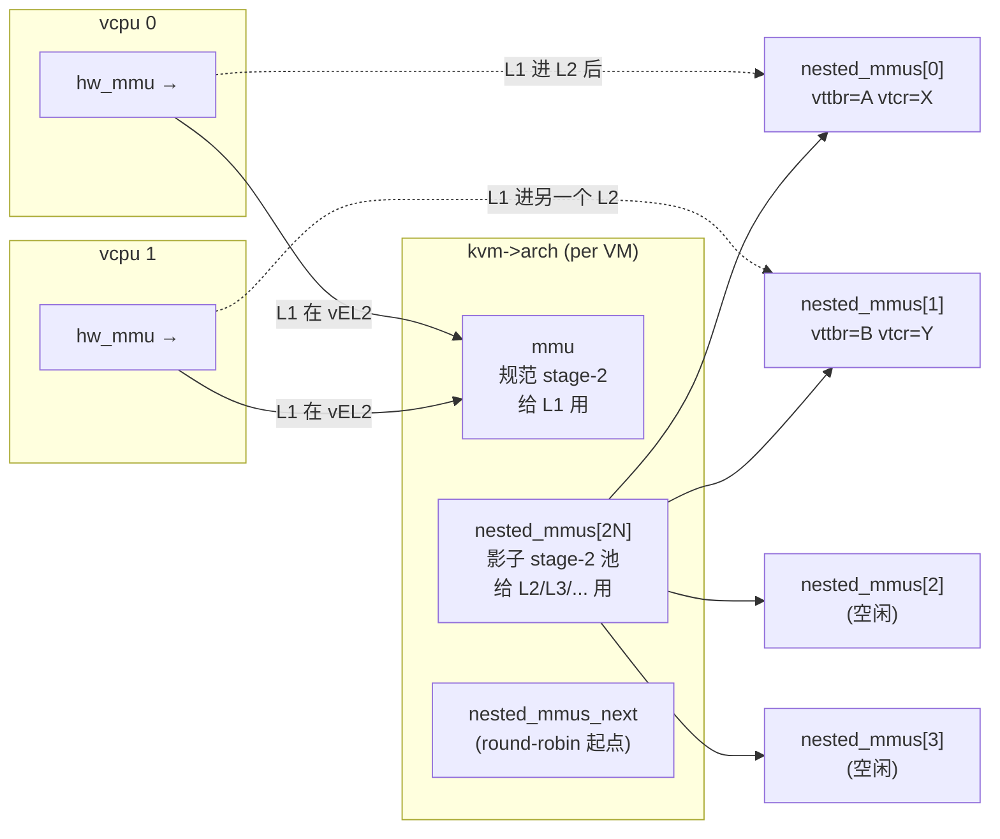

**核心思想**：
- 硬件 stage-2 控制只有一组（`VTTBR_EL2`/`VTCR_EL2`）。L1 想给多个 L2 配置不同的 stage-2 → KVM 必须把 L1 的"虚拟" `vVTTBR_EL2` + `vVTCR_EL2` 元组**复用映射**到一组**影子**页表上。
- 一个 L1 vCPU 在不同时刻可能跑不同的 L2，每个 L2 有自己的 `(vVTTBR, vVTCR)`，对应一份影子页表 → 池化管理。
- 池容量 = `online_vcpus * 2`，超过则**轮转驱逐**。

---

## 1. 为何需要"池" —— 多客户机问题

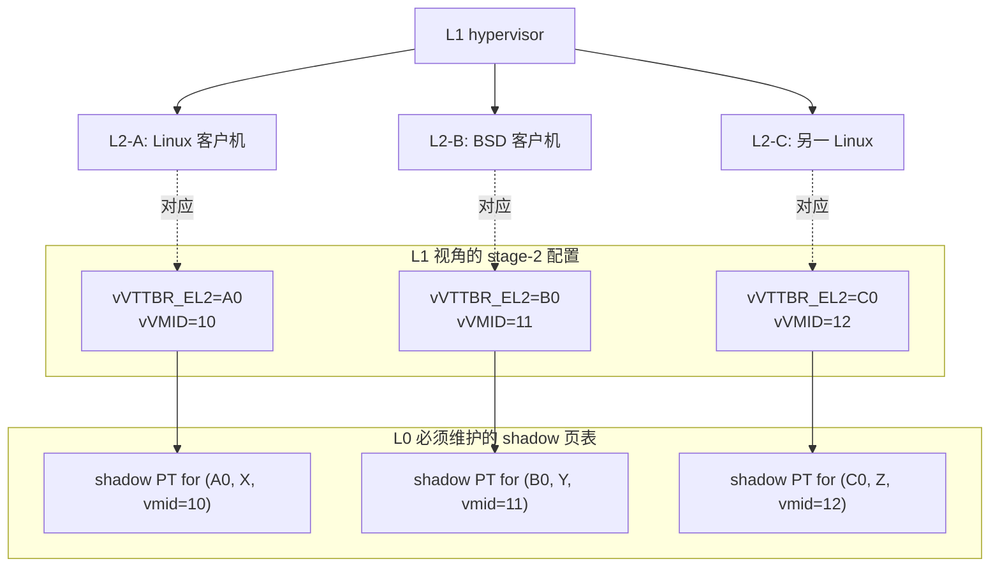

每张 shadow 页表是 vS2（L1 给的）⊗ S2（L0 给 L1 的）的复合（详见 `03-nested-stage2.md`）。

**为什么不能只用一张？**
- 不同 L2 的 IPA 空间是相互独立的，VMID 不同 → 必须分开。
- 切换时 TLB 标签不同（VMID-tagged TLB），分开管理才可正确失效。

**为什么不能"按需现造"（每次 entry 重建）？**
- 一张 stage-2 页表可能涵盖几 GB IPA，重建代价不可接受。
- L2 频繁触发 stage-2 fault，需要把 fault 结果累积下来。

→ 解决方案：固定大小的 LRU/round-robin 池。

---

## 2. `struct kvm_s2_mmu` 全字段拆解

定义位置：`arch/arm64/include/asm/kvm_host.h:153`

```c
struct kvm_s2_mmu {
    struct kvm_vmid vmid;            /* (1) 物理硬件 VMID */
    phys_addr_t pgd_phys;            /* (2) 影子页表根的物理地址 */
    struct kvm_pgtable *pgt;         /* (3) 页表对象 */
    u64 vtcr;                        /* (4) 物理 VTCR_EL2 值 */
    int __percpu *last_vcpu_ran;     /* (5) 每 CPU 上次跑的 vCPU id */

    struct kvm_mmu_memory_cache split_page_cache;
    uint64_t split_page_chunk_size;

    struct kvm_arch *arch;
    u64 tlb_vttbr;                   /* (6) L1 给的 vVTTBR (cached, for matching) */
    u64 tlb_vtcr;                    /* (7) L1 给的 vVTCR  (cached, for matching) */
    bool nested_stage2_enabled;      /* (8) 该 mmu 是否对应 vHCR_EL2.VM=1 */
    bool pending_unmap;              /* (9) 复用前需先 unmap */
    atomic_t refcnt;                 /* (10) 0 = 未占用 */

#ifdef CONFIG_PTDUMP_STAGE2_DEBUGFS
    struct dentry *shadow_pt_debugfs_dentry;
#endif
};
```

字段角色对照：

| 字段 | 谁写 | 谁读 | 含义 |
|---|---|---|---|
| `vmid.id` | KVM VMID 分配器 | hw `VTTBR_EL2` 写入 | 实际写入硬件 VMID 字段，与 L1 的 vVMID **不一定相同** |
| `pgd_phys` | `kvm_init_stage2_mmu` | hw `VTTBR_EL2.BADDR` | shadow 页表根 PA |
| `pgt` | 同上 | walker / fault handler | 操作页表的对象（KVM 的 stage-2 抽象） |
| `vtcr` | `kvm_init_stage2_mmu` (canonical) / `get_s2_mmu_nested` (cache `tlb_vtcr`) | hw `VTCR_EL2` | shadow 页表用的 VTCR（PARange、TG、SL、T0SZ 等）|
| `last_vcpu_ran` | 切换路径 | TLB 失效优化 | 检测 vCPU 迁移以决定是否需要 TLB 维护 |
| `tlb_vttbr` | `get_s2_mmu_nested`：`vcpu_read_sys_reg(VTTBR_EL2) & ~VTTBR_CNP_BIT` | `lookup_s2_mmu` 比较 | **匹配键**：L1 的 vVTTBR（去掉 CnP） |
| `tlb_vtcr` | 同上 | 同上 + TLBI 范围计算 | **匹配键**：L1 的 vVTCR |
| `nested_stage2_enabled` | 同上 | `lookup_s2_mmu` 比较 | 区分 L1 vHCR_EL2.VM=1 vs =0 |
| `pending_unmap` | `get_s2_mmu_nested` 决定复用旧条目时 → true；`check_nested_vcpu_requests` → false | `kvm_make_request(NESTED_S2_UNMAP)` 的处理 | 复用前先清掉旧映射 |
| `refcnt` | `get_s2_mmu_nested` ++ / `kvm_vcpu_put_hw_mmu` --  | 驱逐逻辑、`kvm_arch_flush_shadow_all` | "活跃使用者计数" |

**有效性判定**：

```c
/* arch/arm64/include/asm/kvm_mmu.h:346 */
static inline bool kvm_s2_mmu_valid(struct kvm_s2_mmu *mmu)
{
    return !(mmu->tlb_vttbr & VTTBR_CNP_BIT);
}
```

→ 用 VTTBR 的 bit[0]（CnP 位）作为"无效"哨兵。`kvm_init_nested_s2_mmu` 把它设成 `VTTBR_CNP_BIT`：

```c
/* arch/arm64/kvm/nested.c:772 */
void kvm_init_nested_s2_mmu(struct kvm_s2_mmu *mmu)
{
    /* CnP being set denotes an invalid entry */
    mmu->tlb_vttbr = VTTBR_CNP_BIT;
    mmu->nested_stage2_enabled = false;
    atomic_set(&mmu->refcnt, 0);
}
```

为何选 CnP 位？因为 L1 写入硬件 vVTTBR 时如果设了 CnP（架构上是合法值），会被 `get_s2_mmu_nested` 在缓存到 `tlb_vttbr` 前清掉（`& ~VTTBR_CNP_BIT`），所以 `tlb_vttbr.CnP=1` 这个值在合法状态下永远不会出现 → 完美哨兵。

---

## 3. 池的容量公式：`S2_MMU_PER_VCPU = 2`

```c
/* arch/arm64/kvm/nested.c:43 */
#define S2_MMU_PER_VCPU     2
```

来自代码注释：

> Ratio of live shadow S2 MMU per vcpu. This is a trade-off between memory usage and potential number of different sets of S2 PTs in the guests. Running out of S2 MMUs only affects performance (we will invalidate them more often).

```mermaid
flowchart LR
    A["online_vcpus = N"] --> B["num_mmus = N × 2"]
    B --> C["数组实际大小 = num_mmus<br/>(动态扩展, kvrealloc)"]
    C --> D{"运行时<br/>不同 (vVTTBR,vVTCR)<br/>组数 ≤ 2N?"}
    D -->|是| E[全部命中, 无驱逐]
    D -->|否| F[轮转驱逐 → 性能下降<br/>(unmap+rebuild)]

    style E fill:#dfd
    style F fill:#fdd
```

**容量考量**：
- 单 vCPU 通常一时刻只跑一个 L2，但因为 L2 上下文切换（任务调度）vTTBR 可能变；2 倍预留是经验值。
- 多 vCPU 共享池：vCPU-0 跑 L2-A, vCPU-1 跑 L2-B 时各占一项；vCPU-0 切到 L2-B 时直接命中已有项。
- 池满时仅是**性能问题**（更频繁的 unmap+rebuild），不会语义错误。

---

## 4. 池的初始化

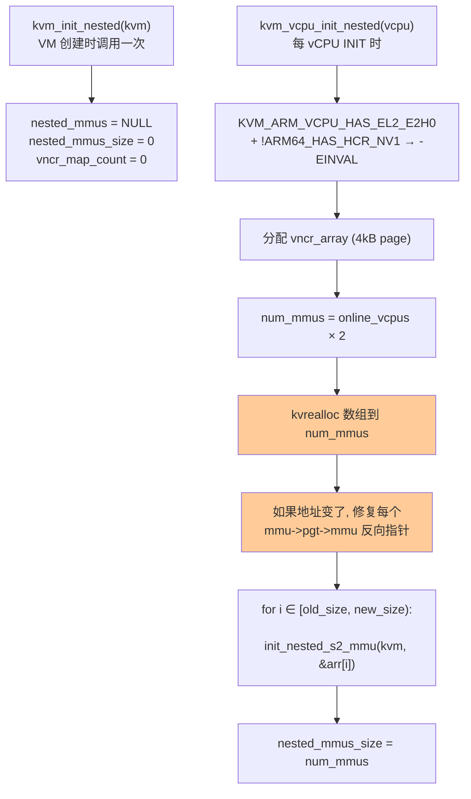

代码 (`arch/arm64/kvm/nested.c:46`)：

```c
void kvm_init_nested(struct kvm *kvm)
{
    kvm->arch.nested_mmus = NULL;
    kvm->arch.nested_mmus_size = 0;
    atomic_set(&kvm->arch.vncr_map_count, 0);
}

int kvm_vcpu_init_nested(struct kvm_vcpu *vcpu)
{
    /* ... 检查 + vncr_array 分配 ... */

    num_mmus = atomic_read(&kvm->online_vcpus) * S2_MMU_PER_VCPU;
    tmp = kvrealloc(kvm->arch.nested_mmus,
            size_mul(sizeof(*kvm->arch.nested_mmus), num_mmus),
            GFP_KERNEL_ACCOUNT | __GFP_ZERO);
    if (!tmp)
        return -ENOMEM;

    swap(kvm->arch.nested_mmus, tmp);

    /* 关键：kvrealloc 可能搬动数组，反向指针要修 */
    if (kvm->arch.nested_mmus != tmp)
        for (int i = 0; i < kvm->arch.nested_mmus_size; i++)
            kvm->arch.nested_mmus[i].pgt->mmu = &kvm->arch.nested_mmus[i];

    /* 给新增的位置初始化 stage-2 页表 */
    for (int i = kvm->arch.nested_mmus_size; !ret && i < num_mmus; i++)
        ret = init_nested_s2_mmu(kvm, &kvm->arch.nested_mmus[i]);

    /* ... 错误清理 ... */
    kvm->arch.nested_mmus_size = num_mmus;
    return 0;
}
```

每个新 mmu 的 `init_nested_s2_mmu` 调用 `kvm_init_stage2_mmu(kvm, mmu, kvm_get_pa_bits(kvm))`：
- 分配 PGD，初始化 `pgt` / `pgd_phys` / `last_vcpu_ran`
- **使用 PARange**（不是 IPA bits）作为 stage-2 输入大小，因为 L1 可以让 L2 看到任意它喜欢的 IPA 空间
- 初始时 `tlb_vttbr = VTTBR_CNP_BIT`（无效）

**踩雷点**：`kvrealloc` 可能搬动数组 → 数组内每个 `pgt` 对象有反向指针 `mmu` 必须更新。`vcpu_init_nested` 如果再次调用（重新 INIT vCPU）时这个修复就启用。

---

## 5. 查找算法：`lookup_s2_mmu`

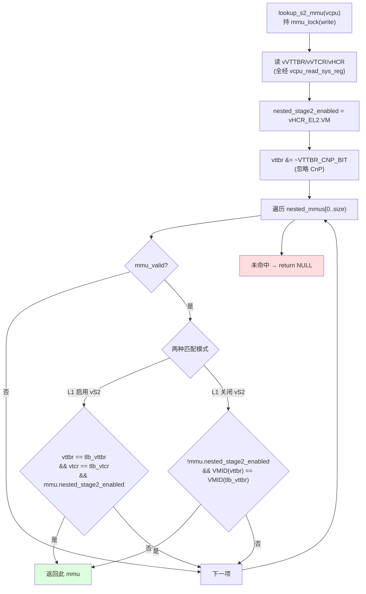

代码 (`arch/arm64/kvm/nested.c:660`)：

```c
struct kvm_s2_mmu *lookup_s2_mmu(struct kvm_vcpu *vcpu)
{
    struct kvm *kvm = vcpu->kvm;
    bool nested_stage2_enabled;
    u64 vttbr, vtcr, hcr;

    lockdep_assert_held_write(&kvm->mmu_lock);

    vttbr = vcpu_read_sys_reg(vcpu, VTTBR_EL2);
    vtcr  = vcpu_read_sys_reg(vcpu, VTCR_EL2);
    hcr   = vcpu_read_sys_reg(vcpu, HCR_EL2);
    nested_stage2_enabled = hcr & HCR_VM;

    /* Don't consider the CnP bit for the vttbr match */
    vttbr &= ~VTTBR_CNP_BIT;

    for (int i = 0; i < kvm->arch.nested_mmus_size; i++) {
        struct kvm_s2_mmu *mmu = &kvm->arch.nested_mmus[i];

        if (!kvm_s2_mmu_valid(mmu))
            continue;

        if (nested_stage2_enabled &&
            mmu->nested_stage2_enabled &&
            vttbr == mmu->tlb_vttbr &&
            vtcr == mmu->tlb_vtcr)
            return mmu;

        if (!nested_stage2_enabled &&
            !mmu->nested_stage2_enabled &&
            get_vmid(vttbr) == get_vmid(mmu->tlb_vttbr))
            return mmu;
    }
    return NULL;
}
```

**两种匹配模式**对照：

| 条件 | "vS2 开" | "vS2 关" |
|---|---|---|
| 触发：L1 vHCR_EL2.VM | 1 | 0 |
| 含义 | L1 给 L2 启用了 stage-2 | L2 自己本来就是 EL2-on-EL2-EL1，不需要 stage-2（仅 VMID-tagged TLB） |
| 匹配键 | 完整 vVTTBR + vVTCR | 仅 VMID（来自 vVTTBR） |
| shadow PT 内容 | vS2 ⊗ S2 复合 | 直接用 canonical S2 (= L1 用的那个，但用不同 VMID) |

第二种模式很容易被忽视：当 vS2 关闭时仍然需要一个 mmu，因为 TLB 仍然按 VMID 标签划分；如果 L1 关掉 vS2 后又开启，TLB 失效精度仍然依赖 VMID。

---

## 6. 分配 + 驱逐：`get_s2_mmu_nested`

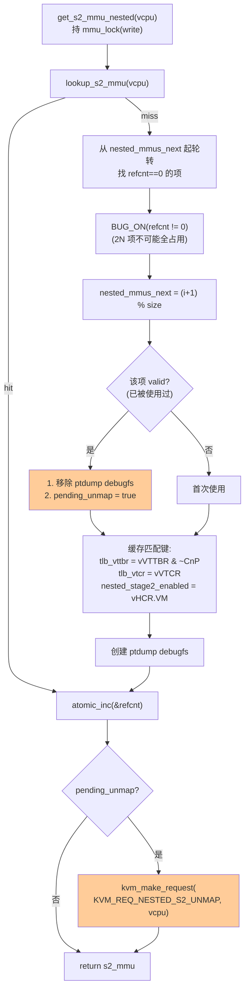

代码 (`arch/arm64/kvm/nested.c:707`)：

```c
static struct kvm_s2_mmu *get_s2_mmu_nested(struct kvm_vcpu *vcpu)
{
    struct kvm *kvm = vcpu->kvm;
    struct kvm_s2_mmu *s2_mmu;
    int i;

    lockdep_assert_held_write(&vcpu->kvm->mmu_lock);

    s2_mmu = lookup_s2_mmu(vcpu);
    if (s2_mmu)
        goto out;

    /*
     * Make sure we don't always search from the same point, or we
     * will always reuse a potentially active context, leaving
     * free contexts unused.
     */
    for (i = kvm->arch.nested_mmus_next;
         i < (kvm->arch.nested_mmus_size + kvm->arch.nested_mmus_next);
         i++) {
        s2_mmu = &kvm->arch.nested_mmus[i % kvm->arch.nested_mmus_size];
        if (atomic_read(&s2_mmu->refcnt) == 0)
            break;
    }
    BUG_ON(atomic_read(&s2_mmu->refcnt));    /* We have struct MMUs to spare */

    /* Set the scene for the next search */
    kvm->arch.nested_mmus_next = (i + 1) % kvm->arch.nested_mmus_size;

    /* Make sure we don't forget to do the laundry */
    if (kvm_s2_mmu_valid(s2_mmu)) {
        kvm_nested_s2_ptdump_remove_debugfs(s2_mmu);
        s2_mmu->pending_unmap = true;
    }

    /*
     * The virtual VMID (modulo CnP) will be used as a key when matching
     * an existing kvm_s2_mmu.
     */
    s2_mmu->tlb_vttbr = vcpu_read_sys_reg(vcpu, VTTBR_EL2) & ~VTTBR_CNP_BIT;
    s2_mmu->tlb_vtcr  = vcpu_read_sys_reg(vcpu, VTCR_EL2);
    s2_mmu->nested_stage2_enabled = vcpu_read_sys_reg(vcpu, HCR_EL2) & HCR_VM;

    kvm_nested_s2_ptdump_create_debugfs(s2_mmu);

out:
    atomic_inc(&s2_mmu->refcnt);

    if (s2_mmu->pending_unmap)
        kvm_make_request(KVM_REQ_NESTED_S2_UNMAP, vcpu);

    return s2_mmu;
}
```

**几个精巧设计**：

1. **轮转起点 `nested_mmus_next`**：避免每次都从 0 找，否则前几项一直被反复重用，后几项永远闲置。
2. **`refcnt==0` 才能复用**：保证别的活跃 vCPU 不被踩到。
3. **`BUG_ON` 哨兵**：因为池容量 = 2N 而最多 N 个 vCPU 同时活跃 → 一定有空闲项；如果触发 BUG 说明 refcnt 漏 dec。
4. **Lazy unmap (`pending_unmap`)**：不在持 mmu_lock 时立刻清旧映射（昂贵），而是延后到 vcpu run loop 通过 `KVM_REQ_NESTED_S2_UNMAP` 清。

---

## 7. `KVM_REQ_NESTED_S2_UNMAP` 延迟解映射

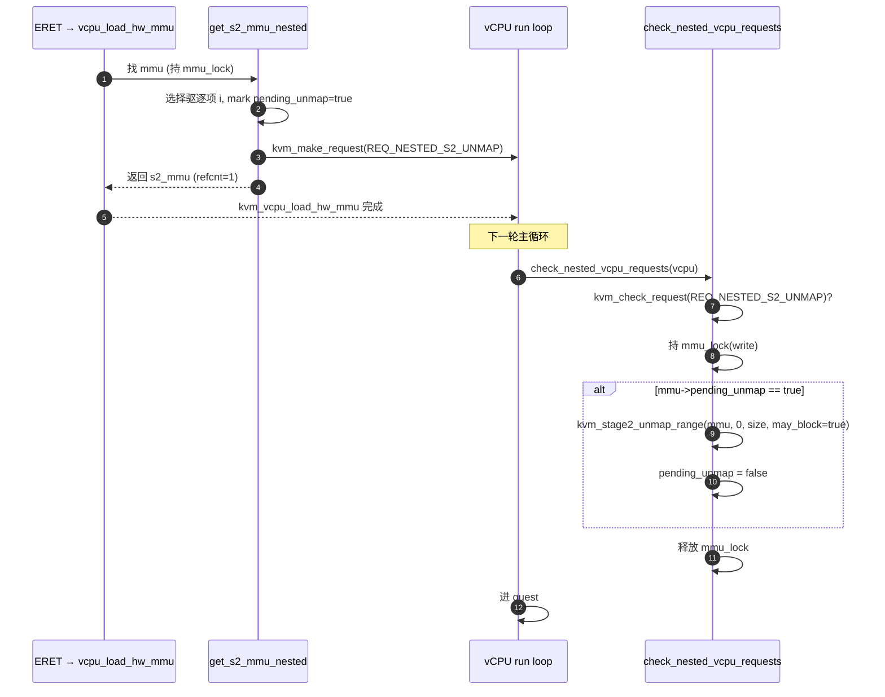

代码 (`arch/arm64/kvm/nested.c:1844`)：

```c
void check_nested_vcpu_requests(struct kvm_vcpu *vcpu)
{
    if (kvm_check_request(KVM_REQ_NESTED_S2_UNMAP, vcpu)) {
        struct kvm_s2_mmu *mmu = vcpu->arch.hw_mmu;

        write_lock(&vcpu->kvm->mmu_lock);
        if (mmu->pending_unmap) {
            kvm_stage2_unmap_range(mmu, 0, kvm_phys_size(mmu), true);
            mmu->pending_unmap = false;
        }
        write_unlock(&vcpu->kvm->mmu_lock);
    }

    if (kvm_check_request(KVM_REQ_MAP_L1_VNCR_EL2, vcpu))
        kvm_map_l1_vncr(vcpu);

    /* Must be last, as may switch context! */
    if (kvm_check_request(KVM_REQ_GUEST_HYP_IRQ_PENDING, vcpu))
        kvm_inject_nested_irq(vcpu);
}
```

> **多 vCPU 协作**：注释提到一个被另一个 vCPU 标记 `pending_unmap=true` 的 mmu，其他 vCPU 也会看到 pending bit，并且每个使用该 mmu 的 vCPU 都被打了 request → "any of them can pitch in to do the unmap"，最终只有第一个走到这里的会真正清空（清完后 `pending_unmap=false`，后续 check 直接跳过）。

---

## 8. 引用计数：`refcnt` 的两组用户

`s2_mmu->refcnt` 是个**短期占用计数**，记录"现在有多少 vCPU 把 `vcpu->arch.hw_mmu` 指向它"。

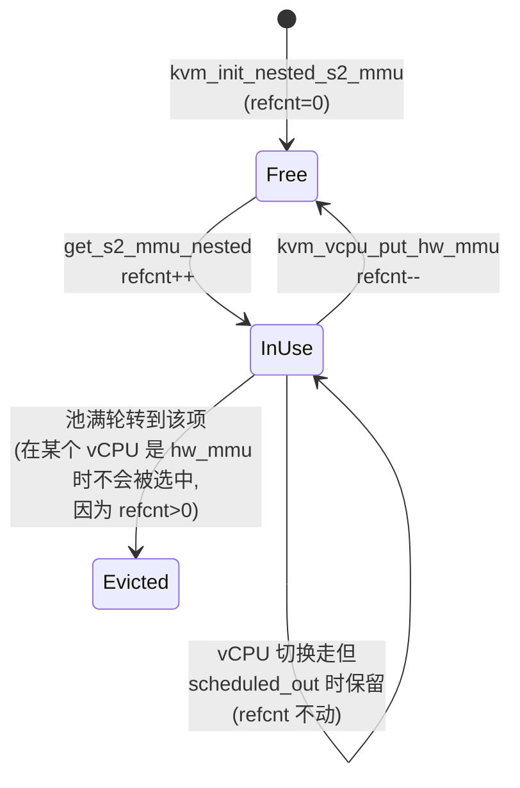

`kvm_vcpu_put_hw_mmu`（`nested.c:802`）的策略：

```c
void kvm_vcpu_put_hw_mmu(struct kvm_vcpu *vcpu)
{
    /* Unconditionally drop the VNCR mapping if we have one */
    if (host_data_test_flag(L1_VNCR_MAPPED)) { ... clear_fixmap ... }

    /*
     * Keep a reference on the associated stage-2 MMU if the vCPU is
     * scheduling out and not in WFI emulation, suggesting it is likely to
     * reuse the MMU sometime soon.
     */
    if (vcpu->scheduled_out && !vcpu_get_flag(vcpu, IN_WFI))
        return;

    if (kvm_is_nested_s2_mmu(vcpu->kvm, vcpu->arch.hw_mmu))
        atomic_dec(&vcpu->arch.hw_mmu->refcnt);

    vcpu->arch.hw_mmu = NULL;
}
```

**关键优化**：调度切换出去时如果不是 WFI，就**保留引用**（不 dec）。这样切回来直接 `kvm_vcpu_load_hw_mmu` 看到 `hw_mmu != NULL` 就复用。理由：调度切换通常很短；WFI 则可能很长（L2 真闲了），让 refcnt 释放出来好让别人复用。

```c
/* arch/arm64/kvm/nested.c:781 */
void kvm_vcpu_load_hw_mmu(struct kvm_vcpu *vcpu)
{
    if (is_hyp_ctxt(vcpu)) {
        if (!vcpu->arch.hw_mmu)
            vcpu->arch.hw_mmu = &vcpu->kvm->arch.mmu;   /* canonical, L1 用 */
    } else {
        if (!vcpu->arch.hw_mmu) {
            scoped_guard(write_lock, &vcpu->kvm->mmu_lock)
                vcpu->arch.hw_mmu = get_s2_mmu_nested(vcpu);
        }
        if (__vcpu_sys_reg(vcpu, HCR_EL2) & HCR_NV)
            kvm_make_request(KVM_REQ_MAP_L1_VNCR_EL2, vcpu);
    }
}
```

---

## 9. VMID：双层语义与 `tlb_vttbr` 的角色

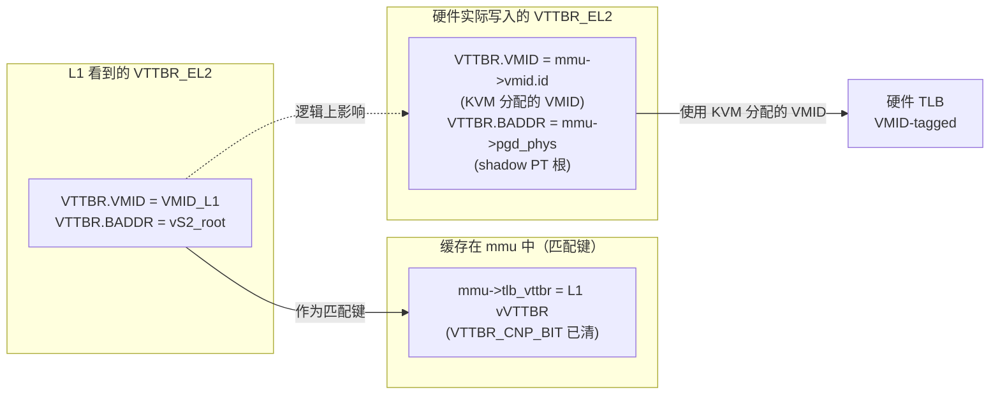

**关键分离**：

- `mmu->vmid.id` 是 KVM 自己的 VMID 分配池中的值（写入硬件 VTTBR_EL2.VMID 字段）。
- `mmu->tlb_vttbr.VMID` 是 L1 给的 VMID，**仅作匹配键使用**。
- 两者一般不相等（L1 选的 VMID 与硬件实际用的 VMID 没有对应关系）。

`get_vmid` 的提取（来自 `arch/arm64/include/asm/kvm_arm.h`）：

```c
#define get_vmid(vttbr)     FIELD_GET(VTTBR_VMID_MASK, vttbr)
```

**`vtcr` 字段的双重身份**：

```c
/* 来自 struct kvm_s2_mmu 注释 (kvm_host.h:153 区块) */
/*
 * VTCR value used on the host. For a non-NV guest (or a NV
 * guest that runs in a context where its own S2 doesn't apply),
 * its T0SZ value reflects that of the IPA size.
 *
 * For a shadow S2 MMU, T0SZ reflects the PARange exposed to
 * the guest.
 */
u64 vtcr;
```

| 字段 | 含义 |
|---|---|
| `mmu->vtcr` | **物理写入 VTCR_EL2 的值**。对 shadow MMU，`T0SZ` 反映 PARange（暴露给 L2 的"物理"地址空间）|
| `mmu->tlb_vtcr` | **L1 给的 vVTCR_EL2 缓存**，用于匹配 + TLBI 范围解析 |

→ 同一 mmu 既要让硬件用合适的 PARange 装载 shadow PT，又要记得 L1 配置的 IPA size（用于 L1 视角的 TLBI）。两个字段分工明确。

---

## 10. 失效路径全集

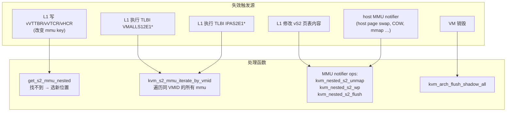

**`kvm_nested_s2_unmap`**（`nested.c:1156`）：清空所有 valid mmu 的全部映射 + 失效 VNCR 缓存

```c
void kvm_nested_s2_unmap(struct kvm *kvm, bool may_block)
{
    int i;
    lockdep_assert_held_write(&kvm->mmu_lock);
    if (!kvm->arch.nested_mmus_size) return;

    for (i = 0; i < kvm->arch.nested_mmus_size; i++) {
        struct kvm_s2_mmu *mmu = &kvm->arch.nested_mmus[i];
        if (kvm_s2_mmu_valid(mmu))
            kvm_stage2_unmap_range(mmu, 0, kvm_phys_size(mmu), may_block);
    }
    kvm_invalidate_vncr_ipa(kvm, 0, BIT(kvm->arch.mmu.pgt->ia_bits));
}
```

`kvm_nested_s2_wp` / `kvm_nested_s2_flush` 类似，对应 write-protect 和 D-cache flush。

**`kvm_arch_flush_shadow_all`**（VM 销毁路径，`nested.c:1196`）：

```c
void kvm_arch_flush_shadow_all(struct kvm *kvm)
{
    int i;
    for (i = 0; i < kvm->arch.nested_mmus_size; i++) {
        struct kvm_s2_mmu *mmu = &kvm->arch.nested_mmus[i];
        if (!WARN_ON(atomic_read(&mmu->refcnt)))
            kvm_free_stage2_pgd(mmu);
    }
    kvfree(kvm->arch.nested_mmus);
    kvm->arch.nested_mmus = NULL;
    kvm->arch.nested_mmus_size = 0;
    kvm_uninit_stage2_mmu(kvm);
}
```

> WARN_ON：如果还有 mmu 的 refcnt != 0，说明 vCPU 没正确 put_hw_mmu，是 bug。

---

## 11. 与 stage-2 fault / TLBI / MMU notifier 的协作

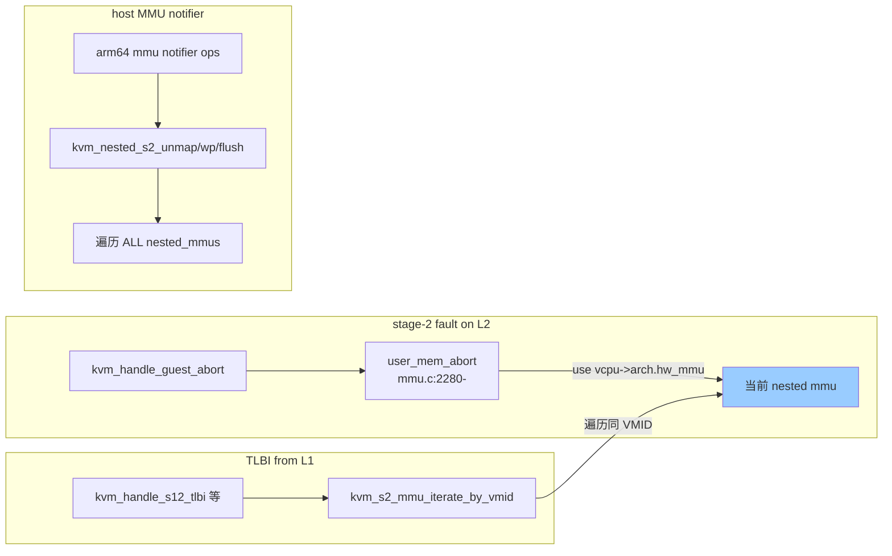

**`kvm_s2_mmu_iterate_by_vmid`**（`nested.c:642`）：当 L1 执行 `TLBI VMALLS12E1IS` 等"全 VMID 失效"指令时，KVM 必须找出**所有匹配该 VMID 的 nested_mmu** 应用失效：

```c
void kvm_s2_mmu_iterate_by_vmid(struct kvm *kvm, u16 vmid,
                                const union tlbi_info *info,
                                void (*tlbi_callback)(struct kvm_s2_mmu *,
                                                      const union tlbi_info *))
{
    write_lock(&kvm->mmu_lock);

    for (int i = 0; i < kvm->arch.nested_mmus_size; i++) {
        struct kvm_s2_mmu *mmu = &kvm->arch.nested_mmus[i];

        if (!kvm_s2_mmu_valid(mmu))
            continue;
        if (vmid == get_vmid(mmu->tlb_vttbr))
            tlbi_callback(mmu, info);
    }
    write_unlock(&kvm->mmu_lock);
}
```

注释（`nested.c:632`）说明设计动机：

> A combination of [...]. We can always identify which MMU context to pick at run-time. However, TLB invalidation involving a VMID must take action on all the TLBs using this particular VMID. This translates into applying the same invalidation operation to all the contexts that are using this VMID. **Moar phun!**

---

## 12. 池中条目的"七生七死"完整生命周期

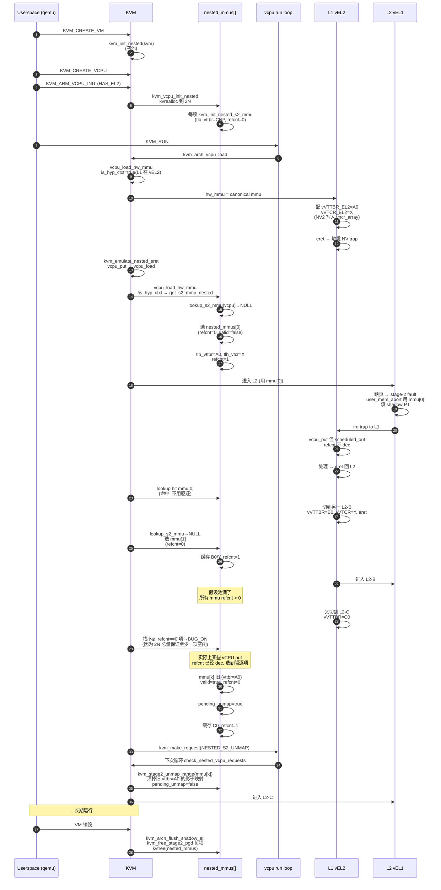

---

## 13. 边界与已知陷阱

| 现象 | 原因 | 行为 |
|---|---|---|
| `BUG_ON(refcnt)` 在 `get_s2_mmu_nested` 内触发 | 池中所有项 refcnt > 0 | 不可能：池容量 2N，活跃 vCPU 最多 N，必有空闲。触发说明 refcnt 计数错误 |
| `kvrealloc` 改变了数组地址但漏更新 `pgt->mmu` | `kvm_vcpu_init_nested` 注释中专门修复 | 否则 stage-2 walker 通过 `pgt->mmu` 反向查找会拿到野指针 |
| L1 把 vVTTBR.CnP 设 1 | KVM 在缓存到 `tlb_vttbr` 前 `& ~VTTBR_CNP_BIT` | 一次匹配；硬件行为没变（只影响 lookup 比较）|
| 同一 VMID 多个 nested_mmu 项 | 完全合法：L1 可能让两个 L2 用同一 VMID 但不同 BADDR/VTCR | TLBI 时 `kvm_s2_mmu_iterate_by_vmid` 全量处理 |
| L1 改 vS2 PT 后忘了 TLBI | `KVM_REQ_NESTED_S2_UNMAP` 不会触发；mmu 内残留旧映射 → 行为未定义 | 这是 L1 自己的 bug，硬件原本也会这样 |
| 池满时 `kvm_arch_flush_shadow_memslot` 调用 | 仅影响 canonical mmu（kvm->arch.mmu）；nested_mmus 由 MMU notifier 全量清 | 性能损失，无语义错误 |
| `kvm_arch_flush_shadow_all` WARN_ON | refcnt != 0 在 VM 销毁时 | 表示某个 vCPU 没正确调用 `kvm_vcpu_put_hw_mmu` |
| L1 用 `nested_stage2_enabled=false`（vHCR.VM=0） | KVM 仍创建 mmu 但只匹配 VMID | 走 "vS2 关" 模式 |
| FEAT_NV1 不支持但 vCPU 设了 E2H0 标志 | `kvm_vcpu_init_nested` `-EINVAL` | 拒绝创建 |

---

## 14. 速查卡

**关键文件 / 行号**

| 路径 | 标识 | 作用 |
|---|---|---|
| `arch/arm64/include/asm/kvm_host.h:153` | `struct kvm_s2_mmu` | 池中每项的数据结构 |
| `arch/arm64/include/asm/kvm_host.h:325-328` | `kvm_arch.nested_mmus / nested_mmus_size / nested_mmus_next` | 池本身 |
| `arch/arm64/include/asm/kvm_mmu.h:346` | `kvm_s2_mmu_valid` | 用 CnP 位作 valid 标志 |
| `arch/arm64/include/asm/kvm_mmu.h:351` | `kvm_is_nested_s2_mmu` | 区分 nested vs canonical |
| `arch/arm64/kvm/nested.c:43` | `S2_MMU_PER_VCPU` | 容量倍率 = 2 |
| `arch/arm64/kvm/nested.c:46` | `kvm_init_nested` | VM 级初始化 |
| `arch/arm64/kvm/nested.c:69` | `kvm_vcpu_init_nested` | 扩容池 + 分配 vncr_array |
| `arch/arm64/kvm/nested.c:660` | `lookup_s2_mmu` | 命中查找 |
| `arch/arm64/kvm/nested.c:707` | `get_s2_mmu_nested` | 分配 + 驱逐 |
| `arch/arm64/kvm/nested.c:772` | `kvm_init_nested_s2_mmu` | 单条目初始化 |
| `arch/arm64/kvm/nested.c:781` | `kvm_vcpu_load_hw_mmu` | vcpu_load 时挂 mmu |
| `arch/arm64/kvm/nested.c:802` | `kvm_vcpu_put_hw_mmu` | vcpu_put 时 dec / lazy keep |
| `arch/arm64/kvm/nested.c:642` | `kvm_s2_mmu_iterate_by_vmid` | TLBI 全 VMID 遍历 |
| `arch/arm64/kvm/nested.c:1156` | `kvm_nested_s2_unmap` | 全池 unmap |
| `arch/arm64/kvm/nested.c:1196` | `kvm_arch_flush_shadow_all` | VM 销毁 |
| `arch/arm64/kvm/nested.c:1844` | `check_nested_vcpu_requests` | 处理 NESTED_S2_UNMAP / MAP_L1_VNCR_EL2 |

**关键 KVM_REQ**

| 请求 | 触发者 | 处理者 |
|---|---|---|
| `KVM_REQ_NESTED_S2_UNMAP` | `get_s2_mmu_nested`（驱逐时） | `check_nested_vcpu_requests` |
| `KVM_REQ_MAP_L1_VNCR_EL2` | `kvm_vcpu_load_hw_mmu` 当 vHCR.NV=1 / `kvm_handle_vncr_abort` | 同上 |
| `KVM_REQ_GUEST_HYP_IRQ_PENDING` | vGIC 嵌套（详见 04） | 同上 |

**核心常量**

| 常量 | 值 | 含义 |
|---|---|---|
| `VTTBR_CNP_BIT` | `BIT(0)` | 兼作 invalid 哨兵 |
| `S2_MMU_PER_VCPU` | 2 | 池容量倍率 |
| `mmu->tlb_vttbr.CnP=1` | invalid | `kvm_init_nested_s2_mmu` 设置 |

**vCPU 的 hw_mmu 状态机**

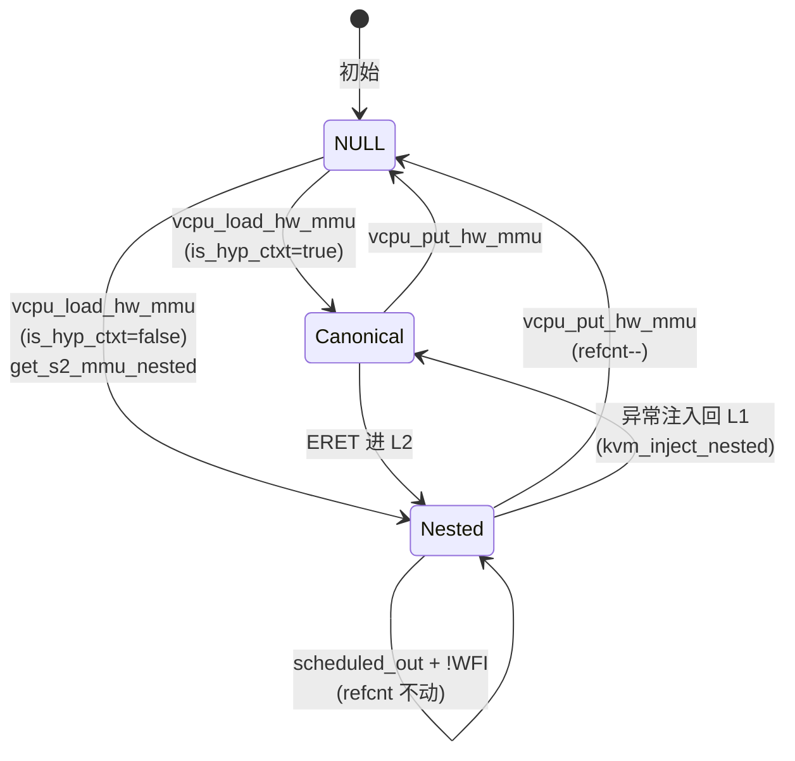

— 完 —
