# aarch64 嵌套虚拟化 (3) —— Stage-2 嵌套翻译

> 基于 `zsdaka/linux` HEAD `8bc67e4db` (v7.1.0-rc4 era) 的 KVM/arm64 实现  
> 系列第 3 篇 · 配套：`01-eret-emulation.md` · `02-shadow-mmu-pool.md` · `04-nested-vgic.md`

---

## 目录

- [aarch64 嵌套虚拟化 (3) —— Stage-2 嵌套翻译](#aarch64-嵌套虚拟化-3--stage-2-嵌套翻译)
  - [目录](#目录)
  - [0. 速读](#0-速读)
  - [1. 嵌套翻译的数学模型](#1-嵌套翻译的数学模型)
  - [2. shadow stage-2：复合的硬件代理](#2-shadow-stage-2复合的硬件代理)
  - [3. 数据结构：`s2_walk_info` / `kvm_s2_trans`](#3-数据结构s2_walk_info--kvm_s2_trans)
  - [4. 软件 walker：`kvm_walk_nested_s2`](#4-软件-walkerkvm_walk_nested_s2)
  - [5. 故障分类与 FSC 编码](#5-故障分类与-fsc-编码)
  - [6. fault 入口：`kvm_handle_guest_abort`](#6-fault-入口kvm_handle_guest_abort)
  - [7. NV 分叉：`user_mem_abort` 中的两层翻译](#7-nv-分叉user_mem_abort-中的两层翻译)
  - [8. 反射 stage-2 fault：`kvm_inject_s2_fault`](#8-反射-stage-2-faultkvm_inject_s2_fault)
  - [9. 权限故障：`kvm_s2_handle_perm_fault`](#9-权限故障kvm_s2_handle_perm_fault)
  - [10. S1PTW 与 SEA：栈中故障的特殊待遇](#10-s1ptw-与-sea栈中故障的特殊待遇)
  - [11. AT 指令模拟：软件 stage-1 walker](#11-at-指令模拟软件-stage-1-walker)
  - [12. TLB invalidation 与 shadow PT 互动](#12-tlb-invalidation-与-shadow-pt-互动)
  - [13. 端到端时序：L2 缺页全流程](#13-端到端时序l2-缺页全流程)
  - [14. 边界与限制](#14-边界与限制)
  - [15. 速查卡](#15-速查卡)

---


## 0. 速读

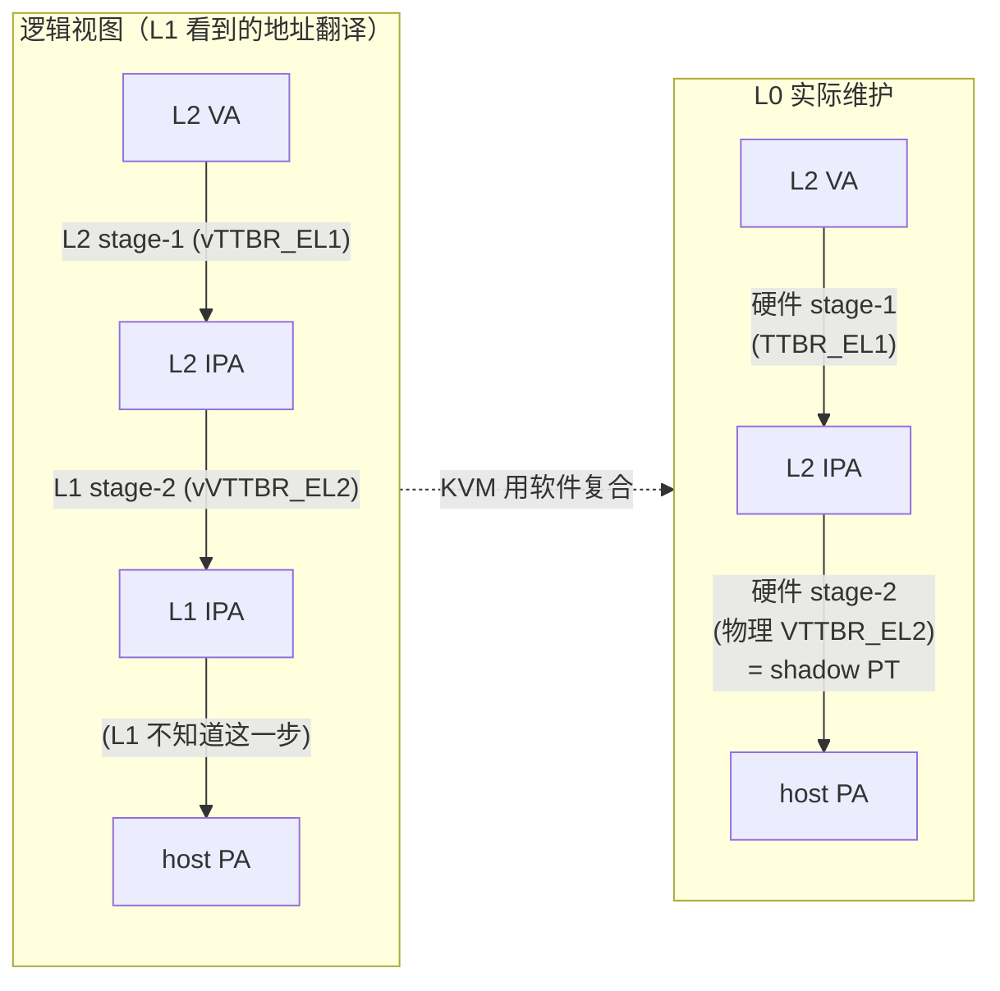

**核心问题**：硬件只支持一级 stage-2 翻译。L1 给 L2 设置的是 vS2（vVTTBR_EL2 → vS2 PT，把 L2 IPA → L1 IPA）；L0 给 L1 设置的是 S2（kvm->arch.mmu，把 L1 IPA → host PA）。L2 实际跑时硬件需要"L2 IPA → host PA"一步到位。

**KVM 解法**：维护**复合的 shadow stage-2 PT**（`vcpu->arch.hw_mmu`，来自 `kvm->arch.nested_mmus[]` 池）。当 L2 在 shadow PT 上缺页时：

1. 软件走 vS2（`kvm_walk_nested_s2`）→ 得到 L1 IPA；
2. 走 L0 的 S2（普通的 `user_mem_abort` → `gfn_to_memslot` → `__kvm_faultin_pfn`）→ 得到 host PA；
3. 把 (L2 IPA → host PA, 权限取 vS2 ⊓ S2) 装进 shadow PT。

如果第 1 步在 vS2 中就缺失（说明 L1 自己的 vS2 PT 不包含此映射），KVM **反射**一个 stage-2 fault 给 L1 vEL2，让 L1 决定如何处理。

---

## 1. 嵌套翻译的数学模型

```
                        T_S1                   T_vS2                T_S2
        L2 VA  ──────────────────►  L2 IPA  ──────────►  L1 IPA  ──────────►  host PA
                  ↑                            ↑                       ↑
               vTTBR_EL1                    vVTTBR_EL2             VTTBR_EL2
            (L1 给 L2 的页表)              (L1 给 L2 的 stage-2)   (L0 给 L1 的)
```

**复合**：对 ∀ L2_VA, host_PA = T_S2(T_vS2(T_S1(L2_VA)))

硬件只能做一级 stage-2，所以 KVM 把 `T_vS2 ∘ T_S2` 折叠成一个：

```
                T_S1                  T_shadow
   L2 VA  ──────────────────►  L2 IPA  ────────►  host PA
              ↑                          ↑
           vTTBR_EL1               物理 VTTBR_EL2
       (L2 自己设的, 直接用)     = vcpu->arch.hw_mmu->pgd_phys
```

**权限合成规则**（来自 `kvm_s2_handle_perm_fault` 与 `walk_nested_s2_pgd` 联合体现）：

| 属性 | shadow PT 的对应值 |
|---|---|
| readable | vS2.readable ∧ S2.readable |
| writable | vS2.writable ∧ S2.writable |
| executable_EL1 | vS2.x_EL1 ∧ S2.x（更严格） |
| executable_EL0 | vS2.x_EL0 ∧ S2.x |
| AF (Access Flag) | shadow PT 自维护 |
| memory attributes | 一般取 vS2 的（具体合并规则参见 ARM ARM D8.5） |

KVM 的实现策略是 **lazy composition**：shadow PT 一开始为空；fault 时才走 vS2 + S2 算出对应项填入。

---

## 2. shadow stage-2：复合的硬件代理

每个 L2 客户机对应一项 `kvm_s2_mmu`（详见 `02-shadow-mmu-pool.md`）。

| 维度 | L1 的 vS2（在 L1 内存中） | L0 的 S2（kvm->arch.mmu） | shadow stage-2（kvm->arch.nested_mmus[i]） |
|---|---|---|---|
| 翻译关系 | L2 IPA → L1 IPA | L1 IPA → host PA | L2 IPA → host PA（复合） |
| BADDR | L1 写到 vVTTBR_EL2.BADDR | L0 自管 | `mmu->pgd_phys` |
| 谁负责填充 | L1 hypervisor | L0 KVM（普通 KVM 路径） | L0 KVM（fault 时按需 walk）|
| 何时被硬件用 | 不会（硬件只用 shadow） | L1 跑时 | L2 跑时 |
| 内存属性 | L1 IPA 中的某些页 | host kernel 一部分内存 | 同上（但用 shadow root） |

**shadow PT 的特殊编码**：除了标准的 stage-2 PTE 字段外，KVM 还利用 PTE 中的若干软件位记录 vS2 的"块大小级别"——这样在 TLBI 时如果没有 TTL 提示，可以从 shadow PT 恢复出原本块大小。

```c
/* arch/arm64/kvm/nested.c:518 (get_guest_mapping_ttl) 的精髓 */
level = FIELD_GET(KVM_NV_GUEST_MAP_SZ, pte);
```

`KVM_NV_GUEST_MAP_SZ` 宏定义在 `kvm_pgtable.h`，占用 PTE 中"软件保留"的位段。这是嵌套实现独有的优化。

---

## 3. 数据结构：`s2_walk_info` / `kvm_s2_trans`

### 3.1 `struct s2_walk_info`（`nested.c:227`）

walker 的输入参数：从 vVTTBR_EL2/vVTCR_EL2 解码得到。

```c
struct s2_walk_info {
    u64           baddr;        /* vVTTBR.BADDR (L1 IPA, 指向 vS2 根表) */
    unsigned int  max_oa_bits;  /* 输出地址位数上限 (来自 vVTCR.PS) */
    unsigned int  pgshift;      /* 12/14/16 (TG0=4K/16K/64K) */
    unsigned int  sl;           /* 起始级别参数 */
    unsigned int  t0sz;         /* T0SZ (输入地址大小) */
    bool          be;           /* 大端 (来自 vSCTLR_EL2.EE) */
    bool          ha;           /* 硬件管理 Access Flag (vVTCR.HA) */
};
```

由 `vtcr_to_walk_info()` 从 vVTCR 解码：

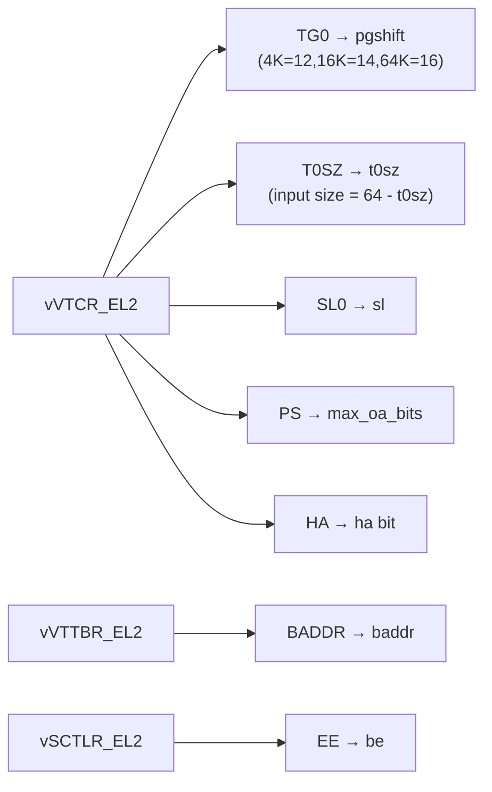

### 3.2 `struct kvm_s2_trans`（`kvm_nested.h:84`）

walker 的输出：

```c
struct kvm_s2_trans {
    phys_addr_t   output;       /* 翻译后的 L1 IPA */
    unsigned long block_size;   /* 该映射覆盖的块大小 */
    bool          writable;     /* vS2 给的写权限 */
    bool          readable;     /* vS2 给的读权限 */
    int           level;        /* 到达的级别 (0..3) */
    u32           esr;          /* 失败时的 ESR.FSC（成功为 0） */
    u64           desc;         /* 最终 PTE 描述符（用于诊断） */
};
```

辅助 inline：

| 函数 | 返回值 |
|---|---|
| `kvm_s2_trans_output(trans)` | `trans->output` |
| `kvm_s2_trans_size(trans)` | `trans->block_size` |
| `kvm_s2_trans_esr(trans)` | `trans->esr` |
| `kvm_s2_trans_readable(trans)` | `trans->readable` |
| `kvm_s2_trans_writable(trans)` | `trans->writable` |
| `kvm_s2_trans_exec_el0(kvm, trans)` | 解码 `desc` 中的 EL0 执行位（受 XNX 影响） |
| `kvm_s2_trans_exec_el1(kvm, trans)` | 同上 EL1 |

---

## 4. 软件 walker：`kvm_walk_nested_s2`

整体逻辑遵循 ARM ARM `AArch64.TranslationTableWalk` 伪代码（代码注释明确说明，`nested.c:240`）。

### 4.1 顶层入口

```c
/* arch/arm64/kvm/nested.c:403 */
int kvm_walk_nested_s2(struct kvm_vcpu *vcpu, phys_addr_t gipa,
                       struct kvm_s2_trans *result)
{
    u64 vtcr = vcpu_read_sys_reg(vcpu, VTCR_EL2);
    struct s2_walk_info wi;
    int ret;

    result->esr = 0;
    if (!vcpu_has_nv(vcpu))
        return 0;                                /* 无 NV → 不是嵌套 */

    wi.baddr = vcpu_read_sys_reg(vcpu, VTTBR_EL2);
    vtcr_to_walk_info(vtcr, &wi);
    wi.be = vcpu_read_sys_reg(vcpu, SCTLR_EL2) & SCTLR_ELx_EE;

    ret = walk_nested_s2_pgd(vcpu, gipa, &wi, result);
    if (ret)
        result->esr |= (kvm_vcpu_get_esr(vcpu) & ~ESR_ELx_FSC);
                                                  /* 保留原 ESR 中其它字段，仅替换 FSC */
    return ret;
}
```

### 4.2 walker 主体的状态机

`walk_nested_s2_pgd`（`nested.c:243`）是 ARM `AArch64.TranslationTableWalk` 的 C 化：

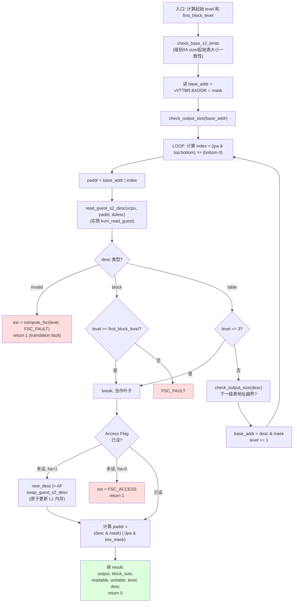

### 4.3 关键细节

**(1) Read-from-guest**：

```c
/* arch/arm64/kvm/nested.c:209 */
static int read_guest_s2_desc(struct kvm_vcpu *vcpu, phys_addr_t pa, u64 *desc,
                              struct s2_walk_info *wi)
{
    u64 val;
    int r;

    r = kvm_read_guest(vcpu->kvm, pa, &val, sizeof(val));   /* L1 IPA → host */
    if (r) return r;

    if (wi->be)
        *desc = be64_to_cpu((__force __be64)val);
    else
        *desc = le64_to_cpu((__force __le64)val);
    return 0;
}
```

> `pa` 是 L1 的 IPA（vS2 PT 在 L1 物理空间中的位置）。`kvm_read_guest` 走的是 **L0 的 S2**（通过 memslot），把 L1 IPA → host VA → 读 → 拿到 vS2 PTE。

**(2) Access Flag 自动设置**：

```c
if (wi->ha)
    new_desc |= KVM_PTE_LEAF_ATTR_LO_S2_AF;

if (new_desc != desc) {
    ret = swap_guest_s2_desc(vcpu, paddr, desc, new_desc, wi);  /* 原子 cmpxchg L1 内存 */
    if (ret)
        return ret;
    desc = new_desc;
}
```

`swap_guest_s2_desc` → `__kvm_at_swap_desc(kvm, pa, old, new)`：在 L1 内存中原子地把 PTE 从 old 改成 new（`cmpxchg`）。这模拟 ARM HA（Hardware Access flag management）。

**(3) FSC 编码**：

```c
static u32 compute_fsc(int level, u32 fsc)
{
    return fsc | (level & 0x3);
}
```

ARM ESR.FSC 的低 2 位是 level，高位是 fault 类型。`compute_fsc(2, ESR_ELx_FSC_FAULT)` 表示 level-2 的 translation fault。

---

## 5. 故障分类与 FSC 编码

walker 在不同位置返回不同的 FSC：

| 位置 | FSC | 含义 |
|---|---|---|
| `walk_nested_s2_pgd` invalid PTE | `FSC_FAULT \| level` | translation fault @ level |
| 块/表大小不一致 | `FSC_FAULT \| level` | 同上 |
| `check_output_size` 失败 | `FSC_ADDRSZ \| level` | address size fault |
| `read_guest_s2_desc` 出错 | `FSC_SEA_TTW(level)` | sync external abort on TTW |
| Access Flag 未设且 HA=0 | `FSC_ACCESS \| level` | access flag fault |
| 权限不匹配（在 user_mem_abort 第二阶段） | `FSC_PERM \| level` | permission fault |

ARM ARM 的 FSC 字段（5 位）取值：

```
0b0000xx (00)  Address size fault          (level encoded)
0b0001xx (04)  Translation fault           (level encoded)
0b0010xx (08)  Access flag fault           (level encoded)
0b0011xx (0c)  Permission fault            (level encoded)
0b010000 (10)  Synchronous External Abort (no walk)
0b010100 (14)  Sync EA on translation walk (level encoded)
...
```

→ KVM 用 `compute_fsc(level, ...)` 与 `ESR_ELx_FSC_*` 宏组合得到完整 FSC。

---

## 6. fault 入口：`kvm_handle_guest_abort`

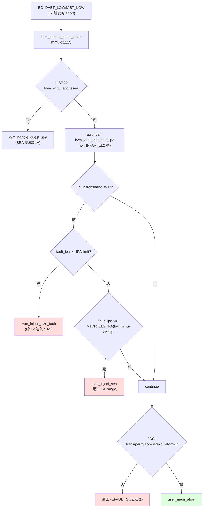

**为何在入口先做 IPA 范围检查？** 因为 KVM 给 L1 暴露的 IPA 限制（PARange）和 L1 给 L2 暴露的 IPA 限制（vVTCR_EL2_IPA）可能不同：
- 如果 fault 的地址超过 `get_kvm_ipa_limit()`（L0 的硬上限）→ 给 L2 注入 size fault；
- 如果在 L0 限制内但超过 `VTCR_EL2_IPA(hw_mmu->vtcr)`（L0 现在用的 shadow VTCR） → 这是 L1 给 L2 设了一个不能映射的"无效 IPA" → 给 L2 注入 SEA。

---

## 7. NV 分叉：`user_mem_abort` 中的两层翻译

```mermaid
flowchart TD
    UMA[user_mem_abort 入口] --> NV{kvm_is_nested_s2_mmu<br/>&& nested_stage2_enabled?}

    NV -->|否| FAST["走原有路径<br/>fault_ipa 即 L1 IPA"]
    NV -->|是| W["kvm_walk_nested_s2(vcpu,<br/>fault_ipa, &nested_trans)"]

    W --> WR{ret 值?}
    WR -->|"-EAGAIN"| RET[ret=1, return<br/>(srcu rcu retry)]
    WR -->|"非 0"| INJ["kvm_inject_s2_fault<br/>(把 nested_trans.esr 反射给 L1)"]
    WR -->|"0"| PERM["kvm_s2_handle_perm_fault"]

    PERM --> PR{forward_fault?}
    PR -->|是| INJ2["kvm_inject_s2_fault<br/>(perm fault)"]
    PR -->|否| OUT["ipa = nested_trans.output<br/>(L1 IPA)<br/>nested = &nested_trans"]
    OUT --> CONT["继续 user_mem_abort:<br/>memslot/__kvm_faultin_pfn/<br/>kvm_pgtable_stage2_map<br/>(填 shadow PT)"]
    FAST --> CONT
    
    style INJ fill:#fc9
    style INJ2 fill:#fc9
    style CONT fill:#dfd
```

代码（`mmu.c:2287-`）：

```c
if (kvm_is_nested_s2_mmu(vcpu->kvm, vcpu->arch.hw_mmu) &&
    vcpu->arch.hw_mmu->nested_stage2_enabled) {
    u32 esr;

    ret = kvm_walk_nested_s2(vcpu, fault_ipa, &nested_trans);
    if (ret == -EAGAIN) {
        ret = 1;
        goto out_unlock;
    }

    if (ret) {
        esr = kvm_s2_trans_esr(&nested_trans);
        kvm_inject_s2_fault(vcpu, esr);
        goto out_unlock;
    }

    ret = kvm_s2_handle_perm_fault(vcpu, &nested_trans);
    if (ret) {
        esr = kvm_s2_trans_esr(&nested_trans);
        kvm_inject_s2_fault(vcpu, esr);
        goto out_unlock;
    }

    ipa = kvm_s2_trans_output(&nested_trans);   /* 用 L1 IPA 继续 */
    nested = &nested_trans;
}

/* 用 ipa (L1 IPA) 找 memslot, faultin pfn ... */
gfn = ipa >> PAGE_SHIFT;
memslot = gfn_to_memslot(vcpu->kvm, gfn);
hva = gfn_to_hva_memslot_prot(memslot, gfn, &writable);
/* ... 后续走标准 user_mem_abort，最终 kvm_pgtable_stage2_map(mmu->pgt, fault_ipa, ...) */
```

**关键点**：

- 用 `fault_ipa` （L2 IPA）作为 shadow PT 装入键，因为硬件在 L2 上看到的就是这个地址。
- 但 `gfn_to_memslot` 用 `ipa` （L1 IPA）查 host 内存，因为 memslot 描述的是 L0 给 L1 看到的"客户机物理空间"。
- 这两个地址在嵌套场景下不同！`nested_trans` 起到桥梁作用。

---

## 8. 反射 stage-2 fault：`kvm_inject_s2_fault`

```c
/* arch/arm64/kvm/nested.c:858 */
int kvm_inject_s2_fault(struct kvm_vcpu *vcpu, u64 esr_el2)
{
    vcpu_write_sys_reg(vcpu, vcpu->arch.fault.far_el2, FAR_EL2);
    vcpu_write_sys_reg(vcpu, vcpu->arch.fault.hpfar_el2, HPFAR_EL2);

    return kvm_inject_nested_sync(vcpu, esr_el2);
}
```

写三个寄存器后调用 `kvm_inject_nested_sync`（详见 `01-eret-emulation.md` §9）：

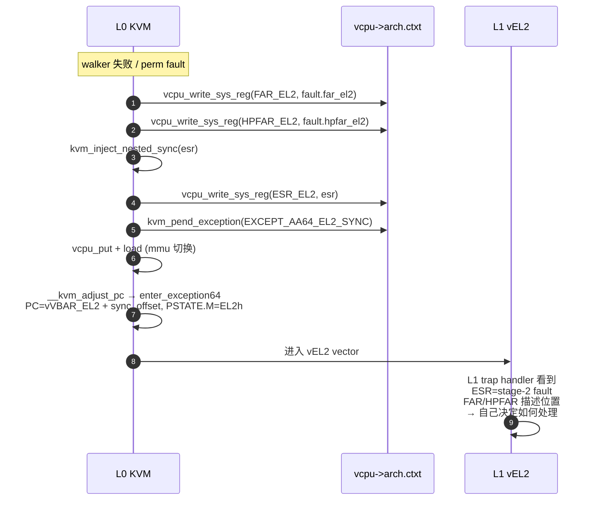

`vcpu->arch.fault.far_el2` 和 `vcpu->arch.fault.hpfar_el2` 是硬件在产生异常时填的（`struct kvm_vcpu_fault_info` in `kvm_host.h`）：

| 字段 | 来源 | 含义 |
|---|---|---|
| `esr_el2` | hw ESR_EL2 | 异常综合 |
| `far_el2` | hw FAR_EL2 | 出错的 VA（栈地址 / 数据地址） |
| `hpfar_el2` | hw HPFAR_EL2 | 出错的 IPA[51:12] |
| `disr_el1` | for SError | SError 描述 |

注意：`esr` 参数与 `vcpu->arch.fault.esr_el2` **不一定相同** —— 我们替换了 FSC 字段（用 walker 算出的 FSC），其余字段（WnR, S1PTW, ISV...）保留。

---

## 9. 权限故障：`kvm_s2_handle_perm_fault`

```c
/* arch/arm64/kvm/nested.c:831 */
int kvm_s2_handle_perm_fault(struct kvm_vcpu *vcpu, struct kvm_s2_trans *trans)
{
    bool forward_fault = false;
    trans->esr = 0;

    if (!kvm_vcpu_trap_is_permission_fault(vcpu))
        return 0;                                 /* 不是 perm fault, 不用我们管 */

    if (kvm_vcpu_trap_is_iabt(vcpu)) {
        if (vcpu_mode_priv(vcpu))
            forward_fault = !kvm_s2_trans_exec_el1(vcpu->kvm, trans);
        else
            forward_fault = !kvm_s2_trans_exec_el0(vcpu->kvm, trans);
    } else {
        bool write_fault = kvm_is_write_fault(vcpu);
        forward_fault = ((write_fault && !trans->writable) ||
                         (!write_fault && !trans->readable));
    }

    if (forward_fault)
        trans->esr = esr_s2_fault(vcpu, trans->level, ESR_ELx_FSC_PERM);
    return forward_fault;
}
```

**判断逻辑**：

```mermaid
flowchart TD
    P["进入 kvm_s2_handle_perm_fault"] --> A{"硬件 FSC 是<br/>permission fault?"}
    A -->|否| OK[return 0<br/>非权限故障, 让 caller 继续]
    A -->|是| IS{"指令 abort (IABT)?"}
    IS -->|是| PV{"vcpu mode priv?"}
    PV -->|是 (vEL1)| EX1{"vS2 允许 EL1 exec?<br/>(kvm_s2_trans_exec_el1)"}
    PV -->|否 (vEL0)| EX0{"vS2 允许 EL0 exec?"}
    IS -->|否 (DABT)| WF{"write fault?"}
    WF -->|是| WW{"vS2.writable?"}
    WF -->|否| WR{"vS2.readable?"}
    EX1 -->|否| FWD[forward_fault=true]
    EX0 -->|否| FWD
    WW -->|否| FWD
    WR -->|否| FWD
    EX1 -->|是| LOC[forward_fault=false<br/>L0 自己处理]
    EX0 -->|是| LOC
    WW -->|是| LOC
    WR -->|是| LOC
    FWD --> SE["trans->esr =<br/>esr_s2_fault(vcpu, level, FSC_PERM)"]
    SE --> RFF[return 1]
    LOC --> RT0[return 0]

    style FWD fill:#fc9
    style LOC fill:#dfd
    style RFF fill:#fc9
```

**为什么权限故障可能是"L0 处理而不反射 L1"？** 因为它可能是 **shadow PT 的权限**比 vS2 严格（access flag 优化、write protect 等），但实际 vS2 允许；这种情况 L0 自己重新装入即可，不该打扰 L1。`kvm_s2_handle_perm_fault` 只在"vS2 真的不允许"时才反射。

`esr_s2_fault` 辅助：

```c
static int esr_s2_fault(struct kvm_vcpu *vcpu, int level, u32 fsc)
{
    u32 esr;
    esr = kvm_vcpu_get_esr(vcpu) & ~ESR_ELx_FSC;   /* 保留原 ESR，仅替换 FSC */
    esr |= compute_fsc(level, fsc);
    return esr;
}
```

---

## 10. S1PTW 与 SEA：栈中故障的特殊待遇

**S1PTW** = Stage-1 Page Table Walk fault：在执行 stage-1 walk 过程中，硬件读取页表项时遇到 stage-2 fault。

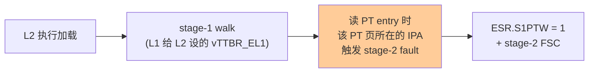

**`host_owns_sea`**（`mmu.c:2130`）的判断：

```c
static bool host_owns_sea(struct kvm_vcpu *vcpu, u64 esr)
{
    if (!cpus_have_final_cap(ARM64_HAS_RAS_EXTN))
        return true;                              /* 无 RAS, host 必须处理 */

    /* KVM owns the VNCR when the vCPU isn't in a nested context. */
    if (is_hyp_ctxt(vcpu) && !kvm_vcpu_trap_is_iabt(vcpu) && (esr & ESR_ELx_VNCR))
        return true;                              /* L1 在 vEL2, 是 VNCR 引发 */

    /*
     * Determining if an external abort during a table walk happened at
     * stage-2 is only possible with S1PTW is set. ...
     */
    return (esr_fsc_is_sea_ttw(esr) && (esr & ESR_ELx_S1PTW));
}
```

→ KVM 看到 `S1PTW=1 + SEA on TTW` → 是 host 自己内核分配 stage-2 页表内存导致的 SEA → 不该传给 guest。

`ESR_ELx_VNCR` 位 (bit 13)：当 EL=EL2 且访问由 VNCR 重定向触发的 abort 时硬件置位。L1 在 vEL2 跑时它的 NV2 内存重定向产生 fault → ESR.VNCR=1 → 这是"L0 应该自己处理 vncr abort"的信号（详见 `kvm_handle_vncr_abort`，本文不展开）。

---

## 11. AT 指令模拟：软件 stage-1 walker

L1 执行 `AT S1E1R/W/A`、`AT S1E0R/W/A`、`AT S1E2R/W/A` 等地址翻译指令时，KVM 必须模拟。代码在 `arch/arm64/kvm/at.c`（1799 行）。

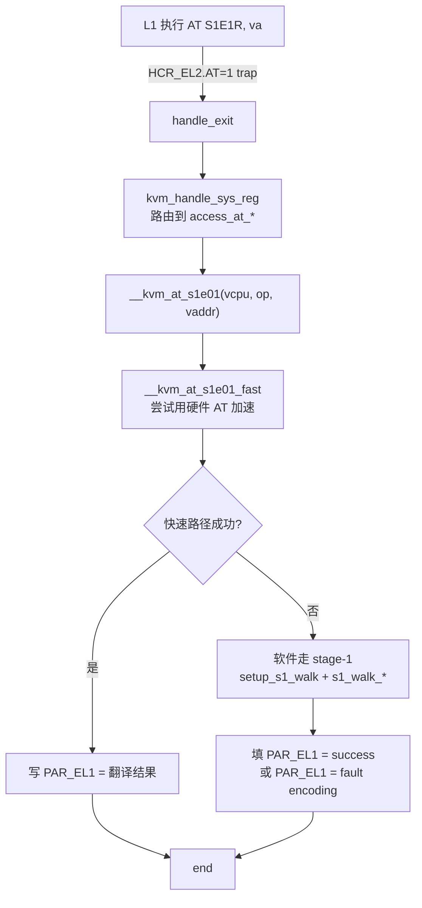

**为什么需要软件路径？** 因为 L1 的 vTTBR_EL1（注意：不是物理 TTBR_EL1，而是它逻辑上想让 L2 用的那个）可能：

1. 不在硬件 EL1 sysreg 上（L1 跑在 vEL2 时）；
2. 翻译会产生权限故障，硬件 AT 也会反映，但**ESR 编码不一致** → 需要软件再算一次。

`at.c` 提供完整的 stage-1 walker：

```c
struct s1_walk_info {
    u64           baddr;
    enum trans_regime regime;       /* TR_EL10, TR_EL20, TR_EL2 */
    unsigned int  max_oa_bits;
    unsigned int  pgshift;
    unsigned int  txsz;
    int           sl;
    bool          hpd;              /* 阶段-1 hierarchical permission disable */
    bool          e0poe;            /* effective EL0 PoE */
    bool          poe;              /* PoE for non-EL0 */
    bool          pan;              /* PAN bit */
    bool          be;
    bool          s2;
    bool          pa52bit;
    bool          ha, hd;           /* hardware AF/DBM management */
    bool          as_el0;           /* doing translation as if from EL0 */
};

struct s1_walk_result {
    union {
        struct {                    /* successful walk */
            u64 desc;
            u64 pa;
            s8  level;
            u8  APTable;
            bool UXNTable, PXNTable, uwxn, uov, ur, uw, ux;
            bool pwxn, pov, pr, pw, px;
            bool nG;
            u16 asid;
        };
        struct {                    /* failed walk */
            u8   fst;               /* fault status code */
            bool ptw;               /* page table walk */
            bool s2;                /* stage-2 fault inside walk */
        };
    };
    bool failed;
};
```

`at.c` 的入口函数（顶层）：

| 函数 | 处理指令 | 说明 |
|---|---|---|
| `__kvm_at_s1e01` | `AT S1E0R/W/A`, `AT S1E1R/W/A/RP/WP` | 在 EL1&0 翻译机制下走 |
| `__kvm_at_s1e2`  | `AT S1E2R/W/A` | 在 EL2&0 翻译机制下（vEL2 视图） |
| `__kvm_at_s12`   | `AT S12E0/1/2*` | 复合翻译：S1 + S2 |

最终都填回 `PAR_EL1`（Physical Address Register）：成功时低 56 位是 PA，高位是属性；失败时 bit[0]=1 + 描述故障的字段。

> 由于 AT 模拟代码量极大且与本系列其它主题正交，仅作纲领介绍。完整理解请直接阅读 `arch/arm64/kvm/at.c`。

---

## 12. TLB invalidation 与 shadow PT 互动

L1 执行 TLBI 指令（如 `TLBI VMALLS12E1IS`）会被 trap 到 L0。代码路径：

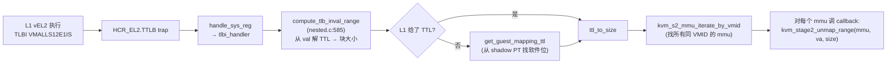

代码（`nested.c:585`）：

```c
unsigned long compute_tlb_inval_range(struct kvm_s2_mmu *mmu, u64 val)
{
    unsigned long max_size;
    u8 ttl;

    ttl = FIELD_GET(TLBI_TTL_MASK, val);
    if (!ttl || !kvm_has_feat(kvm, ID_AA64MMFR2_EL1, TTL, IMP)) {
        u64 addr = (val & GENMASK_ULL(35, 0)) << 12;
        ttl = get_guest_mapping_ttl(mmu, addr);    /* shadow PT 反查 */
    }

    max_size = ttl_to_size(ttl);
    if (!max_size) {
        /* fallback: 用 VTCR_EL2.TG0 求"最大可能块" */
        switch (FIELD_GET(VTCR_EL2_TG0_MASK, mmu->tlb_vtcr)) {
        case VTCR_EL2_TG0_4K:  max_size = SZ_1G;   break;
        case VTCR_EL2_TG0_16K: max_size = SZ_32M;  break;
        case VTCR_EL2_TG0_64K: default: max_size = SZ_512M; break;
        }
    }
    return max_size;
}
```

`get_guest_mapping_ttl`（`nested.c:518`）反查 shadow PT：

```c
/*
 * Compute the equivalent of the TTL field by parsing the shadow PT.  The
 * granule size is extracted from the cached VTCR_EL2.TG0 while the level is
 * retrieved from first entry carrying the level as a tag.
 */
static u8 get_guest_mapping_ttl(struct kvm_s2_mmu *mmu, u64 addr)
{
    /* ... 迭代不同 sz 用 kvm_pgtable_get_leaf 查 shadow PT ...
     * 找到一个有效 PTE 后取 KVM_NV_GUEST_MAP_SZ 字段（软件位）
     * 算出 ttl */
}
```

**为什么要这么麻烦？** ARM 的 TLBI 指令可以带 TTL 提示让硬件只失效特定级别；但 L1 不一定带 TTL（老硬件不支持，或代码懒）。没有 TTL 时 KVM 必须保守地按"最大可能块大小"失效，否则放过了某些条目；shadow PT 中藏了级别信息可以更精确。

---

## 13. 端到端时序：L2 缺页全流程

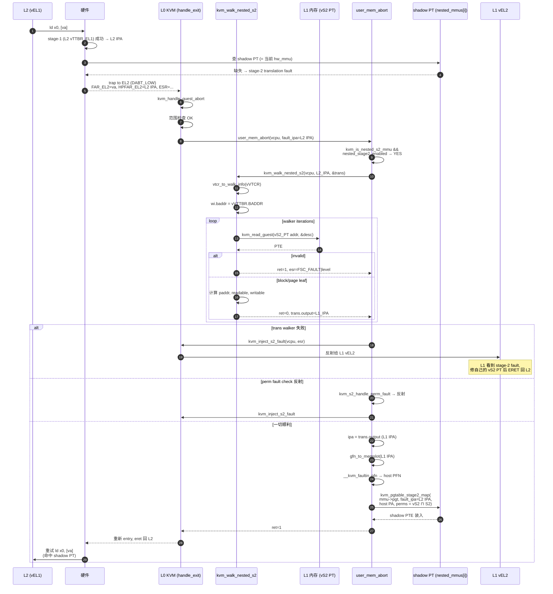

---

## 14. 边界与限制

| 现象 | 处理方式 | 备注 |
|---|---|---|
| 52-bit IPA in nested | **未支持**（代码注释明确） | `compute_tlb_inval_range` 注释 "No, we do not support 52bit IPA in nested yet. Once we do, this should be 4TB." |
| L2 IPA 超过 `get_kvm_ipa_limit()` | `kvm_inject_size_fault` | 完全无效 |
| L2 IPA 在 L0 限制内但超过 vVTCR_EL2.IPA | `kvm_inject_sea` | L1 给 L2 的 IPA 配置错 |
| vS2 walker 中 SEA on TTW（L1 给的 vS2 PT 物理上不可达） | `FSC_SEA_TTW` 反射 | L0 通过 `kvm_read_guest` 失败传递 |
| vS2 PTE 的 AF 没设 + HA=0 | `FSC_ACCESS` 反射给 L1 | 让 L1 自己设 AF |
| vS2 PTE 的 AF 没设 + HA=1 | walker 用 `__kvm_at_swap_desc` 原子改 vS2 内存 | 模拟硬件管理 AF |
| `walk_nested_s2_pgd` 返回 -EAGAIN | `user_mem_abort` 重试 | srcu / mmu_lock 释放后重试 |
| permission fault 但 vS2 允许 | L0 自处理（不反射） | shadow PT 严格于 vS2 是常见情况 |
| TLBI without TTL hint 旧硬件 | 反查 shadow PT 软件位 | 性能下降但正确 |
| L1 同时改 vS2 + 没有 TLBI | 行为未定义（同硬件） | KVM 不补救 |
| AT 指令（13 个变种） | `at.c` 1799 行专门模拟 | 见 §11 |

---

## 15. 速查卡

**关键文件 / 行号**

| 路径 | 标识 | 作用 |
|---|---|---|
| `arch/arm64/kvm/nested.c:243` | `walk_nested_s2_pgd` | 软件 stage-2 walker 主体 |
| `arch/arm64/kvm/nested.c:403` | `kvm_walk_nested_s2` | walker 顶层 |
| `arch/arm64/kvm/nested.c:209` | `read_guest_s2_desc` | 读 vS2 PTE |
| `arch/arm64/kvm/nested.c:399` | `swap_guest_s2_desc` / `__kvm_at_swap_desc` | 原子更新 PTE (AF) |
| `arch/arm64/kvm/nested.c:831` | `kvm_s2_handle_perm_fault` | 决定权限故障是否反射 |
| `arch/arm64/kvm/nested.c:858` | `kvm_inject_s2_fault` | 反射 stage-2 fault 给 L1 |
| `arch/arm64/kvm/nested.c:585` | `compute_tlb_inval_range` | TLBI 范围解析 |
| `arch/arm64/kvm/nested.c:518` | `get_guest_mapping_ttl` | 反查 shadow PT 算 TTL |
| `arch/arm64/kvm/mmu.c:2215` | `kvm_handle_guest_abort` | 异常入口 |
| `arch/arm64/kvm/mmu.c:2287` | `user_mem_abort` 中的 NV 分叉 | 嵌套 walker 调用 |
| `arch/arm64/kvm/mmu.c:2130` | `host_owns_sea` | SEA/S1PTW 决策 |
| `arch/arm64/kvm/at.c` (整个文件) | `__kvm_at_s1e01/s1e2/s12` | AT 指令模拟 |

**关键宏 / 编码**

| 名称 | 值 / 含义 |
|---|---|
| `KVM_PTE_VALID` | bit 0, PTE 有效 |
| `KVM_PTE_TYPE` | block vs table 类型字段 |
| `KVM_PTE_LEAF_ATTR_LO_S2_S2AP_R/W` | stage-2 读/写权限 |
| `KVM_PTE_LEAF_ATTR_LO_S2_AF` | Access Flag |
| `KVM_NV_GUEST_MAP_SZ` | 软件位，记录 vS2 块大小级别 |
| `ESR_ELx_FSC_FAULT` | 0x04 \| level — translation fault |
| `ESR_ELx_FSC_PERM` | 0x0c \| level — permission |
| `ESR_ELx_FSC_ACCESS` | 0x08 \| level — access flag |
| `ESR_ELx_FSC_ADDRSZ` | 0x00 \| level — address size |
| `ESR_ELx_FSC_SEA_TTW(level)` | sync external abort on table walk |
| `ESR_ELx_S1PTW` | bit 7, S1 walk 期间的 stage-2 fault |
| `ESR_ELx_VNCR` | bit 13, VNCR 触发的 abort |
| `VTTBR_CNP_BIT` | bit 0, 兼作 invalid 标记 |
| `VTCR_EL2_IPA(vtcr)` | 从 VTCR.T0SZ 算 IPA bits |

**FSC 编码速查**

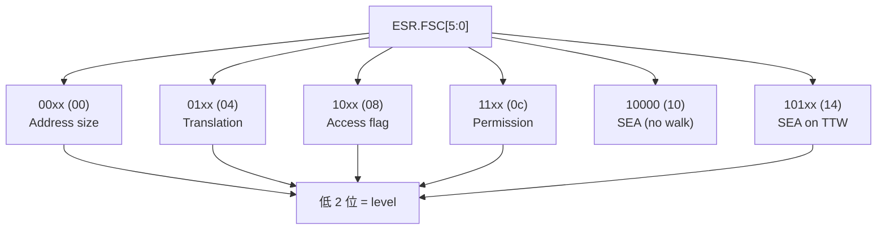

**`kvm_s2_trans` 字段 → 用户**

| 字段 | 谁读 | 谁写 |
|---|---|---|
| `output` | `user_mem_abort` 取 L1 IPA | walker leaf |
| `block_size` | 上层做对齐 | walker leaf |
| `readable/writable` | `kvm_s2_handle_perm_fault` | walker leaf |
| `level` | `compute_fsc` / esr | walker |
| `esr` | `kvm_inject_s2_fault` | walker / `kvm_s2_handle_perm_fault` |
| `desc` | 诊断 / `kvm_s2_trans_exec_*` | walker leaf |

**故障"去向"决策树**

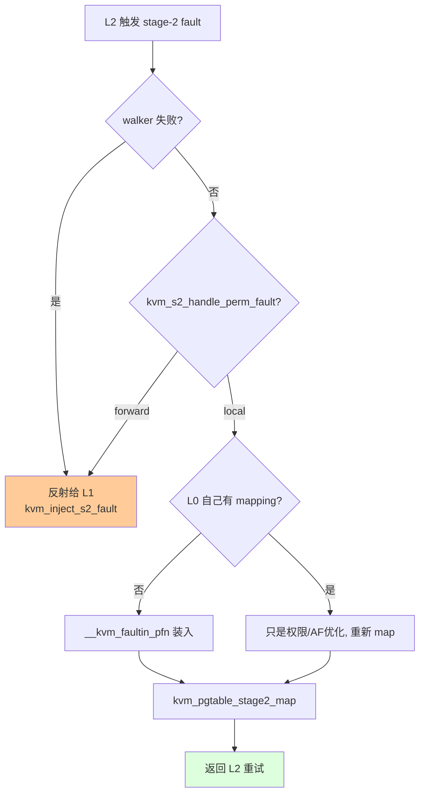

— 完 —
