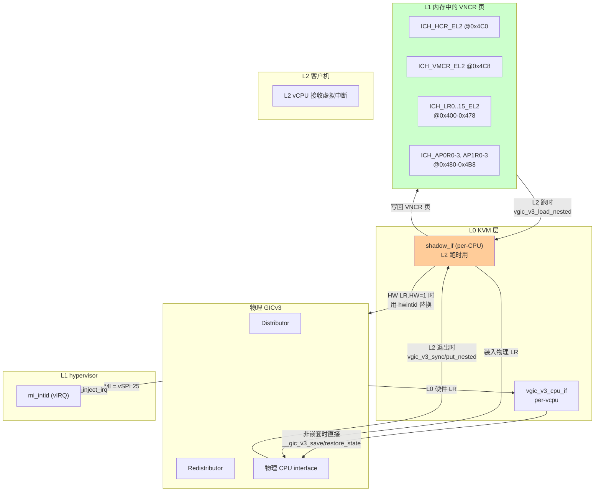
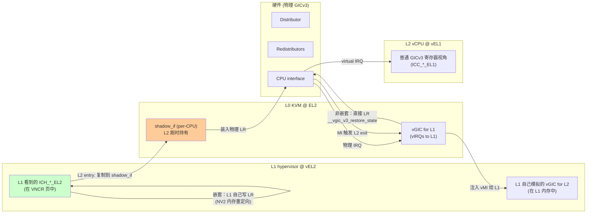
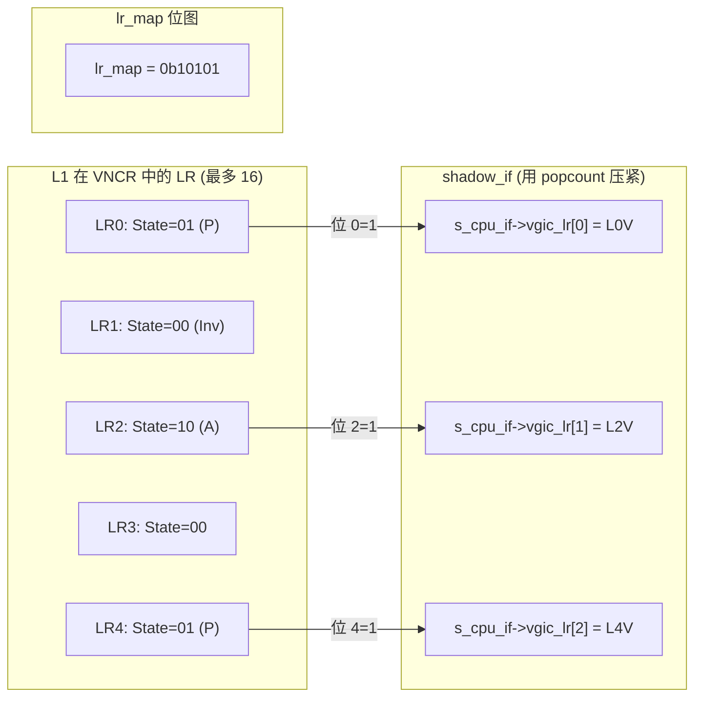
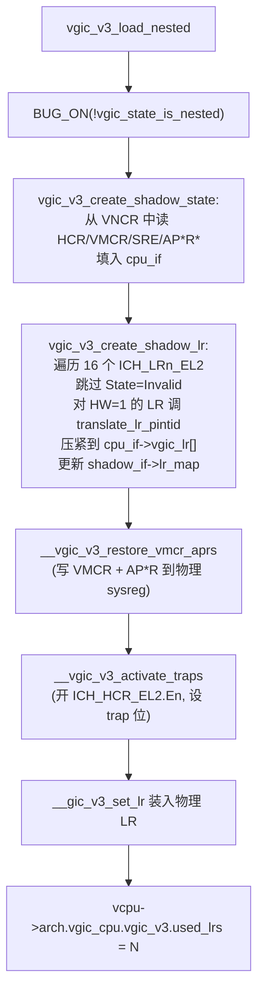
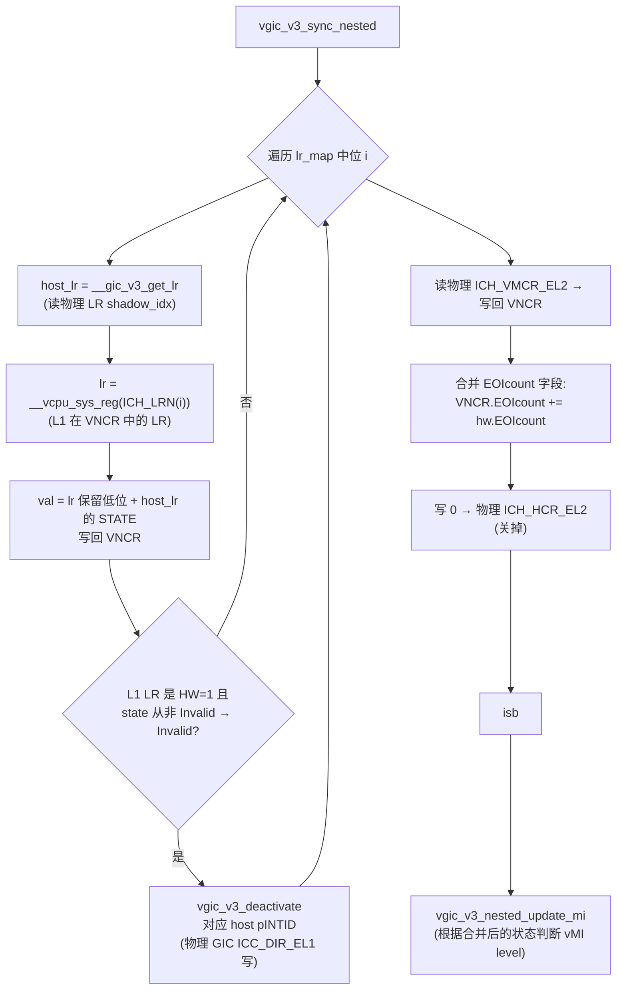
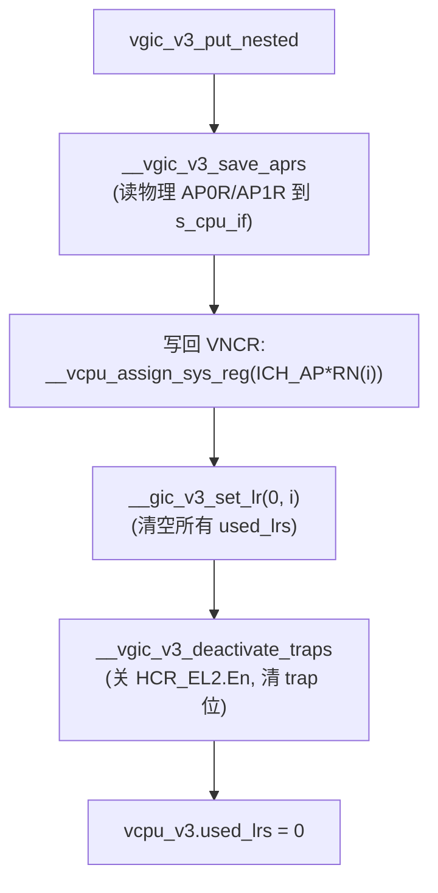
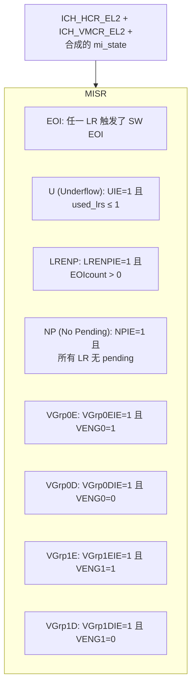
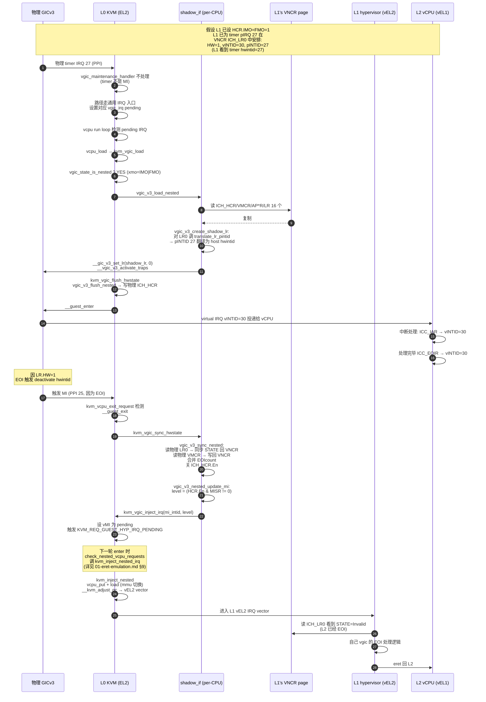
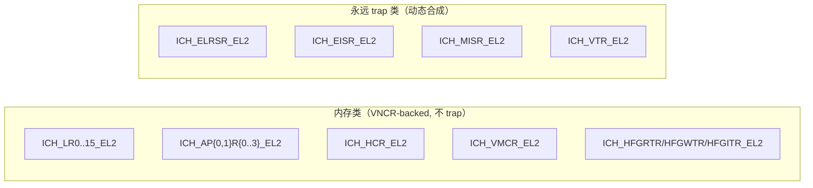
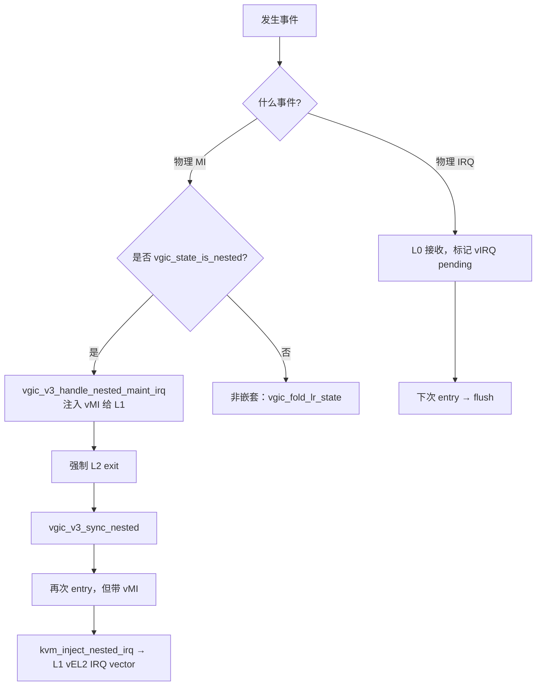

# aarch64 嵌套虚拟化 (4) —— vGICv3 嵌套虚拟化

> 基于 `zsdaka/linux` HEAD `8bc67e4db` (v7.1.0-rc4 era) 的 KVM/arm64 实现  
> 系列第 4 篇 · 配套：`01-eret-emulation.md` · `02-shadow-mmu-pool.md` · `03-nested-stage2.md`

---

## 目录

- [aarch64 嵌套虚拟化 (4) —— vGICv3 嵌套虚拟化](#aarch64-嵌套虚拟化-4--vgicv3-嵌套虚拟化)
  - [目录](#目录)
  - [0. 速读](#0-速读)
  - [1. GICv3 虚拟化基础回顾](#1-gicv3-虚拟化基础回顾)
  - [2. 三层 GIC 模型](#2-三层-gic-模型)
  - [3. ICH\_\* 寄存器在 VNCR 页中的布局](#3-ich_-寄存器在-vncr-页中的布局)
  - [4. 寄存器分类：内存类 vs 永远 trap 类](#4-寄存器分类内存类-vs-永远-trap-类)
  - [5. `vgic_state_is_nested` 状态判断](#5-vgic_state_is_nested-状态判断)
  - [6. `shadow_if`：每 CPU 的影子 cpuif](#6-shadow_if每-cpu-的影子-cpuif)
  - [7. L2 entry 路径：`vgic_v3_load_nested`](#7-l2-entry-路径vgic_v3_load_nested)
  - [8. L2 进入前 flush：`vgic_v3_flush_nested`](#8-l2-进入前-flushvgic_v3_flush_nested)
  - [9. L2 退出 sync：`vgic_v3_sync_nested`](#9-l2-退出-syncvgic_v3_sync_nested)
  - [10. L2 退出 put：`vgic_v3_put_nested`](#10-l2-退出-putvgic_v3_put_nested)
  - [11. Maintenance Interrupt 三层路由](#11-maintenance-interrupt-三层路由)
  - [12. ELRSR / EISR / MISR：动态合成](#12-elrsr--eisr--misr动态合成)
  - [13. HW interrupt 通道（pINTID 重映射）](#13-hw-interrupt-通道pintid-重映射)
  - [14. 端到端时序：物理 IRQ → L0 → L1 → L2](#14-端到端时序物理-irq--l0--l1--l2)
  - [15. 边界与限制](#15-边界与限制)
  - [16. 速查卡](#16-速查卡)

---


## 0. 速读



**核心思想**：
- 非嵌套时，KVM 完全控制 LR，把 IRQ 投递给 L1。
- 嵌套（L2 跑时），**L1 自己直接控制 LR**（通过 VNCR 内存重定向）。L0 只在 L2 entry/exit 时把 L1 在 VNCR 页中的 LR 配置**复制**到物理 LR（"shadow"）。
- HW bit 处理：L1 设的 HW LR 携带"L1 自己看的 pINTID"，L0 必须翻译成"host 真正的 pINTID"，否则物理 GIC 不认。
- Maintenance Interrupt（MI）作为 L2→L1 的"桥"：L2 跑时收到的 MI → L0 → 注入虚拟 MI 给 L1，L1 醒来后看到自己 vGIC 的 EOI 状态。

---

## 1. GICv3 虚拟化基础回顾

GICv3 提供"硬件中断虚拟化"：在 EL2 软件控制下，可以让 EL1 直接 ack/eoi 虚拟中断，不必每次都 trap。关键寄存器（运行在 EL2，操控 vCPU interface）：

| 寄存器 | 字段意义 | 访问方式 |
|---|---|---|
| `ICH_HCR_EL2` | Hypervisor Control（En, UIE, LRENPIE, NPIE, VGrp0/1EIE/DIE, EOIcount） | 系统寄存器 |
| `ICH_VMCR_EL2` | 虚拟 Machine Control（VENG0, VENG1, VFIQEn, VAckCtl, VEOIM, VBPR0/1, VPMR） | 系统寄存器 |
| `ICH_LR<n>_EL2` | List Register：投递给 vCPU 的中断（最多 16 个） | 系统寄存器 |
| `ICH_AP0R<n>_EL2`, `ICH_AP1R<n>_EL2` | Active Priorities Register | 系统寄存器 |
| `ICH_MISR_EL2` | Maintenance Interrupt Status（动态合成） | 系统寄存器（只读） |
| `ICH_EISR_EL2` | EOI'd Interrupt Status | 系统寄存器（只读） |
| `ICH_ELRSR_EL2` | Empty List Register Status | 系统寄存器（只读） |

LR 字段布局：

```
 63    62    61    60    59    58    57:32         31:0
+-----+-----+-----+-----+-----+-----+----------+----------+
| HW  | Group | State[1:0]| Priority |  pINTID   |  vINTID  |
+-----+-----+-----+-----+-----+-----+----------+----------+
       (bit 60)             (bit 56:48)
```

- `HW` = 1：硬件 LR——硬件 deactivate 时会同步 deactivate 物理 IRQ（pINTID 字段指向）。
- `State[1:0]`：00=Invalid, 01=Pending, 10=Active, 11=Pending+Active
- `vINTID`：投递给 vCPU 软件看到的 INTID
- `pINTID`：当 HW=1 时配套的物理 INTID

**Maintenance Interrupt (MI)**：当 LR 被 EOI、所有 LR 用完、或某些可配置事件发生时，物理 GIC 会产生一次 MI 给 EL2 软件。

---

## 2. 三层 GIC 模型



**职责划分**：

| 层 | 物理 GIC | 给 L1 的 vGIC | 给 L2 的 vGIC |
|---|---|---|---|
| L0 KVM | 全局共享 | 完全维护 | 仅在 L2 entry/exit 复制 L1 配置 |
| L1 hypervisor | 不可见 | 通过 ICC_* trap | 完全维护（用 VNCR-backed ICH_*_EL2） |
| L2 客户机 | 不可见 | 不可见 | 通过 ICC_* trap 到 L1 |

---

## 3. ICH_* 寄存器在 VNCR 页中的布局

来自 `arch/arm64/include/asm/vncr_mapping.h`：

```c
#define VNCR_ICH_LR0_EL2     0x400
#define VNCR_ICH_LR1_EL2     0x408
/* ... */
#define VNCR_ICH_LR15_EL2    0x478

#define VNCR_ICH_AP0R0_EL2   0x480   /* Active Priority Group 0 */
#define VNCR_ICH_AP0R1_EL2   0x488
#define VNCR_ICH_AP0R2_EL2   0x490
#define VNCR_ICH_AP0R3_EL2   0x498

#define VNCR_ICH_AP1R0_EL2   0x4A0   /* Active Priority Group 1 */
#define VNCR_ICH_AP1R1_EL2   0x4A8
#define VNCR_ICH_AP1R2_EL2   0x4B0
#define VNCR_ICH_AP1R3_EL2   0x4B8

#define VNCR_ICH_HCR_EL2     0x4C0   /* 关键控制 */
#define VNCR_ICH_VMCR_EL2    0x4C8   /* 虚拟 machine control */

#define VNCR_ICH_HFGITR_EL2  0xB10   /* Fine-grained instruction trap */
#define VNCR_ICH_HFGRTR_EL2  0xB18   /* Fine-grained read trap */
#define VNCR_ICH_HFGWTR_EL2  0xB20   /* Fine-grained write trap */
```

VNCR 页中的 ICH 区段视图：

```
                 VNCR base + 0x400
                 ┌──────────────────┐
                 │ ICH_LR0_EL2      │ +0x400
                 │ ICH_LR1_EL2      │ +0x408
                 │ ...              │
                 │ ICH_LR15_EL2     │ +0x478
                 │ ICH_AP0R0..3_EL2 │ +0x480 .. +0x498
                 │ ICH_AP1R0..3_EL2 │ +0x4A0 .. +0x4B8
                 │ ICH_HCR_EL2      │ +0x4C0
                 │ ICH_VMCR_EL2     │ +0x4C8
                 │ ...              │
                 │ ICH_HFGITR_EL2   │ +0xB10
                 │ ICH_HFGRTR_EL2   │ +0xB18
                 │ ICH_HFGWTR_EL2   │ +0xB20
                 └──────────────────┘
```

**关键效果**：当 L1 跑在物理 EL1 + `HCR_EL2.NV2=1` 时，L1 执行 `MSR ICH_LR0_EL2, x0` **不 trap**，硬件直接写 `ctxt.vncr_array[0x400/8]`。这就是 NV2 的核心性能优势之一——把"L1 配置 vGIC"从 trap 变成纯内存操作。

---

## 4. 寄存器分类：内存类 vs 永远 trap 类

来自 `vgic-v3-nested.c` 的开头注释：

> **System register emulation**:  
> We get two classes of registers:  
> - those backed by memory (LRs, APRs, HCR, VMCR): L1 can freely access them, and L0 doesn't see a thing.  
> - those that always trap (ELRSR, EISR, MISR): these are status registers that are built on the fly based on the in-memory state.

| 寄存器 | 类别 | 实现 |
|---|---|---|
| `ICH_LR<n>_EL2` | 内存类 | NV2 重定向到 VNCR 偏移 0x400+ |
| `ICH_AP{0,1}R<n>_EL2` | 内存类 | NV2 重定向到 0x480+ / 0x4A0+ |
| `ICH_HCR_EL2` | 内存类 | NV2 重定向到 0x4C0 |
| `ICH_VMCR_EL2` | 内存类 | NV2 重定向到 0x4C8 |
| `ICH_ELRSR_EL2` | trap 类 | `vgic_v3_get_elrsr` 根据 LR 状态合成 |
| `ICH_EISR_EL2` | trap 类 | `vgic_v3_get_eisr` 根据 LR EOI 触发位合成 |
| `ICH_MISR_EL2` | trap 类 | `vgic_v3_get_misr` 综合多个 HCR/VMCR 位合成 |
| `ICH_VTR_EL2` | trap 类 | 简单返回固定能力描述 |

**为什么 ELRSR/EISR/MISR 不放内存？** 因为它们是**派生状态**——只读，且依赖 HCR/VMCR/LR 当前值，不能预先存。L1 读它们时必须 trap → KVM 现算现给。代码体现：

```c
/* arch/arm64/kvm/vgic/vgic-v3-nested.c:152 */
u16 vgic_v3_get_eisr(struct kvm_vcpu *vcpu)
{
    struct mi_state mi_state;
    vgic_compute_mi_state(vcpu, &mi_state);
    return mi_state.eisr;
}
```

---

## 5. `vgic_state_is_nested` 状态判断

整个嵌套 vGIC 路径是否启用，由这个谓词决定（`vgic-v3-nested.c:118`）：

```c
bool vgic_state_is_nested(struct kvm_vcpu *vcpu)
{
    u64 xmo;

    if (is_nested_ctxt(vcpu)) {
        xmo = __vcpu_sys_reg(vcpu, HCR_EL2) & (HCR_IMO | HCR_FMO);
        WARN_ONCE(xmo && xmo != (HCR_IMO | HCR_FMO),
                  "Separate virtual IRQ/FIQ settings not supported\n");
        return !!xmo;
    }
    return false;
}
```

判断依据：

```mermaid
flowchart TD
    A["vgic_state_is_nested?"] --> B{"is_nested_ctxt(vcpu)?<br/>= vcpu_has_nv && !is_hyp_ctxt"}
    B -->|否| F1["false<br/>(L1 在 vEL2 或非 NV)"]
    B -->|是 (L2 在 vEL1)| C["xmo = vHCR_EL2 & (IMO|FMO)"]
    C --> D{"IMO 与 FMO 同时设置?"}
    D -->|否, 单独某个| W["WARN_ONCE<br/>(KVM 不支持分别开启)"]
    D -->|是| TR[true]
    D -->|都不设| F2[false]

    style TR fill:#dfd
    style F1 fill:#fdd
    style F2 fill:#fdd
    style W fill:#ffc
```

**HCR_EL2.IMO/FMO 的角色**：
- `IMO=1` → 物理 IRQ 投递给 vEL1（被 L1 vGIC 处理），而不是 EL2。
- `FMO=1` → 物理 FIQ 同上。
- 当 L1 给 L2 启用 vGIC 时，必然设 IMO=FMO=1（否则中断到不了 L2）。

→ **L2 跑时这两位都是 1 → `vgic_state_is_nested=true`**；这是 KVM 启动 nested 路径的精确触发条件。

---

## 6. `shadow_if`：每 CPU 的影子 cpuif

```c
struct mi_state {
    u16 eisr;
    u16 elrsr;
    bool pend;
};

struct shadow_if {
    struct vgic_v3_cpu_if cpuif;       /* 投递给硬件的状态 */
    unsigned long lr_map;              /* bitmap: 哪些 LR 索引被 promoted */
};

static DEFINE_PER_CPU(struct shadow_if, shadow_if);
```

**为什么是 per-CPU 而不是 per-vCPU？** 因为 shadow_if 只在"L2 在物理 CPU 上跑"的那一刻有效；下次 vCPU 调度上来时重新构建。

**`lr_map` 位图**：L1 在 VNCR 页中可能配了 16 个 LR，但只有"State != Invalid"的才需要装入物理 LR；`lr_map` 位 i = 1 表示 L1 LR[i] 被 shadow 到物理 LR `popcount(lr_map[0..i])`。



辅助函数 `lr_map_idx_to_shadow_idx`（line 41）：

```c
static int lr_map_idx_to_shadow_idx(struct shadow_if *shadow_if, int idx)
{
    return hweight16(shadow_if->lr_map & (BIT(idx) - 1));
}
```

→ 把"L1 LR 索引"转成"shadow 物理 LR 索引"。

**为什么压紧？** 物理 GIC 上能用的 LR 数 (`kvm_vgic_global_state.nr_lr`) 不一定是 16，可能更少。不能假设 L1 LR i 直接对应物理 LR i。

---

## 7. L2 entry 路径：`vgic_v3_load_nested`

```c
/* arch/arm64/kvm/vgic/vgic-v3-nested.c:341 */
void vgic_v3_load_nested(struct kvm_vcpu *vcpu)
{
    struct shadow_if *shadow_if = get_shadow_if();
    struct vgic_v3_cpu_if *cpu_if = &shadow_if->cpuif;

    BUG_ON(!vgic_state_is_nested(vcpu));

    vgic_v3_create_shadow_state(vcpu, cpu_if);

    __vgic_v3_restore_vmcr_aprs(cpu_if);
    __vgic_v3_activate_traps(cpu_if);

    for (int i = 0; i < cpu_if->used_lrs; i++)
        __gic_v3_set_lr(cpu_if->vgic_lr[i], i);

    /* Propagate the number of used LRs ... */
    vcpu->arch.vgic_cpu.vgic_v3.used_lrs = cpu_if->used_lrs;
}
```



`vgic_v3_create_shadow_state`（line 320）：

```c
static void vgic_v3_create_shadow_state(struct kvm_vcpu *vcpu,
                                        struct vgic_v3_cpu_if *s_cpu_if)
{
    struct vgic_v3_cpu_if *host_if = &vcpu->arch.vgic_cpu.vgic_v3;
    int i;

    s_cpu_if->vgic_hcr  = __vcpu_sys_reg(vcpu, ICH_HCR_EL2);
    s_cpu_if->vgic_vmcr = __vcpu_sys_reg(vcpu, ICH_VMCR_EL2);
    s_cpu_if->vgic_sre  = host_if->vgic_sre;       /* L0 自身的 SRE */

    for (i = 0; i < 4; i++) {
        s_cpu_if->vgic_ap0r[i] = __vcpu_sys_reg(vcpu, ICH_AP0RN(i));
        s_cpu_if->vgic_ap1r[i] = __vcpu_sys_reg(vcpu, ICH_AP1RN(i));
    }

    vgic_v3_create_shadow_lr(vcpu, s_cpu_if);
}
```

**`__vcpu_sys_reg(vcpu, ICH_HCR_EL2)`** —— 注意：这里返回的是 `ctxt.vncr_array[VNCR_ICH_HCR_EL2/8]`（L1 自己写的值），因为 ICH_HCR_EL2 是 VNCR-backed。复制到 cpu_if.vgic_hcr 后再叠加 `vgic_ich_hcr_trap_bits()`（见 §8）。

`vgic_v3_create_shadow_lr`（line 247）和 `translate_lr_pintid`（line 222）：

```c
static u64 translate_lr_pintid(struct kvm_vcpu *vcpu, u64 lr)
{
    struct vgic_irq *irq;

    if (!(lr & ICH_LR_HW))
        return lr;

    /* We have the HW bit set, check for validity of pINTID */
    irq = vgic_get_vcpu_irq(vcpu, FIELD_GET(ICH_LR_PHYS_ID_MASK, lr));
    /* If there was no real mapping, nuke the HW bit */
    if (!irq || !irq->hw || irq->intid > VGIC_MAX_SPI)
        lr &= ~ICH_LR_HW;

    /* Translate the virtual mapping to the real one */
    if (irq) {
        lr &= ~ICH_LR_PHYS_ID_MASK;
        lr |= FIELD_PREP(ICH_LR_PHYS_ID_MASK, (u64)irq->hwintid);
        vgic_put_irq(vcpu->kvm, irq);
    }

    return lr;
}
```

```mermaid
flowchart TD
    LR0["L1 写的 LR<br/>HW=1, pINTID=27 (L1 看的)"] --> CHK1{vgic_get_vcpu_irq(27) 找到<br/>vgic_irq?}
    CHK1 -->|否| NUKE["lr &= ~ICH_LR_HW<br/>(变成纯 SW LR)"]
    CHK1 -->|是, 且 irq->hw=1<br/>且 intid <= MAX_SPI| TRANS["lr.pINTID = irq->hwintid<br/>(host 真正的 INTID)"]
    NUKE --> OUT["返回 lr"]
    TRANS --> OUT
```

**为什么需要翻译？** L1 看到的 pINTID 是它的 host hypervisor（即 L0）暴露给它的虚拟硬件 ID。L0 维护 vgic_irq 结构体记录"L1 看到的 INTID"（`irq->intid`）↔ "host 物理 INTID"（`irq->hwintid`）的映射。物理 LR 必须用 host 的 INTID，否则 deactivate 时 GIC 找不到对应中断。

---

## 8. L2 进入前 flush：`vgic_v3_flush_nested`

`vgic-v3-nested.c:271`：

```c
void vgic_v3_flush_nested(struct kvm_vcpu *vcpu)
{
    u64 val = __vcpu_sys_reg(vcpu, ICH_HCR_EL2);
    write_sysreg_s(val | vgic_ich_hcr_trap_bits(), SYS_ICH_HCR_EL2);
}
```

`vgic_ich_hcr_trap_bits`（`vgic.h:170`）：

```c
static inline u64 vgic_ich_hcr_trap_bits(void)
{
    u64 hcr;
    /* All the traps are in the bottom 16bits */
    asm volatile(ALTERNATIVE_CB("movz %0, #0\n",
                  ARM64_ALWAYS_SYSTEM, kvm_compute_ich_hcr_trap_bits)
                 : "=r" (hcr));
    return hcr;
}
```

通过 ALTERNATIVE 机制启动时 patch 出"L0 想 trap 的 ICH_HCR_EL2 位"。  
**作用**：在物理 ICH_HCR_EL2 上 OR 一些 trap-enable 位，让 L0 仍能监控某些事件（例如 EOIcount 等）。L1 视角中这些位是它自己的；物理 sysreg 中我们再加几个让 L0 用。

**调用时机**：从 `vgic.c:1147 (kvm_vgic_flush_hwstate)` 中：

```c
if (vgic_state_is_nested(vcpu)) {
    if (kvm_vgic_vcpu_pending_irq(vcpu))
        kvm_make_request(KVM_REQ_GUEST_HYP_IRQ_PENDING, vcpu);
    vgic_v3_flush_nested(vcpu);
    return;
}
```

→ 嵌套 flush 远比非嵌套 flush 简单：因为 L1 已经把 LR 都安排好了（在 VNCR 页里），KVM 只需写 HCR 启用 trap 位即可。但要先检查"L0 自己想给 vCPU 投递的 IRQ"有没有 pending —— 如果有，发 `KVM_REQ_GUEST_HYP_IRQ_PENDING` 请求，最终走 `kvm_inject_nested_irq`。

---

## 9. L2 退出 sync：`vgic_v3_sync_nested`

```c
/* vgic-v3-nested.c:278 */
void vgic_v3_sync_nested(struct kvm_vcpu *vcpu)
{
    struct shadow_if *shadow_if = get_shadow_if();
    int i;

    for_each_set_bit(i, &shadow_if->lr_map, kvm_vgic_global_state.nr_lr) {
        u64 val, host_lr, lr;

        host_lr = __gic_v3_get_lr(lr_map_idx_to_shadow_idx(shadow_if, i));

        /* Propagate the new LR state */
        lr = __vcpu_sys_reg(vcpu, ICH_LRN(i));
        val = lr & ~ICH_LR_STATE;
        val |= host_lr & ICH_LR_STATE;
        __vcpu_assign_sys_reg(vcpu, ICH_LRN(i), val);

        if (!((lr & ICH_LR_HW) && (lr & ICH_LR_STATE) && !(host_lr & ICH_LR_STATE)))
            continue;
        /* HW interrupt deactivated by L2 → L0 must deactivate too */
        vgic_v3_deactivate(vcpu, FIELD_GET(ICH_LR_PHYS_ID_MASK, lr));
    }

    /* Sync VMCR back to VNCR */
    __vcpu_assign_sys_reg(vcpu, ICH_VMCR_EL2, read_sysreg_s(SYS_ICH_VMCR_EL2));

    /* Merge EOIcount field */
    __vcpu_rmw_sys_reg(vcpu, ICH_HCR_EL2, &=, ~ICH_HCR_EL2_EOIcount);
    __vcpu_rmw_sys_reg(vcpu, ICH_HCR_EL2, |=,
                       read_sysreg_s(SYS_ICH_HCR_EL2) & ICH_HCR_EL2_EOIcount);

    write_sysreg_s(0, SYS_ICH_HCR_EL2);
    isb();

    vgic_v3_nested_update_mi(vcpu);
}
```

关键步骤分解：



**HW LR 的 deactivate 处理**：硬件在 L2 EOI 一个 HW LR 时会自动 deactivate 物理 IRQ —— 但如果 L1 自己（在 vGIC 层级）把某个 HW LR 标记为 deactivated，L0 必须代替 L1 在物理 GIC 上 deactivate（因为 L1 自己访问 ICC_DIR_EL1 也是 trap）。

---

## 10. L2 退出 put：`vgic_v3_put_nested`

```c
/* vgic-v3-nested.c:363 */
void vgic_v3_put_nested(struct kvm_vcpu *vcpu)
{
    struct shadow_if *shadow_if = get_shadow_if();
    struct vgic_v3_cpu_if *s_cpu_if = &shadow_if->cpuif;
    int i;

    __vgic_v3_save_aprs(s_cpu_if);

    for (i = 0; i < 4; i++) {
        __vcpu_assign_sys_reg(vcpu, ICH_AP0RN(i), s_cpu_if->vgic_ap0r[i]);
        __vcpu_assign_sys_reg(vcpu, ICH_AP1RN(i), s_cpu_if->vgic_ap1r[i]);
    }

    for (i = 0; i < s_cpu_if->used_lrs; i++)
        __gic_v3_set_lr(0, i);

    __vgic_v3_deactivate_traps(s_cpu_if);

    vcpu->arch.vgic_cpu.vgic_v3.used_lrs = 0;
}
```



**与 sync 的分工**：
- `sync`：在 vCPU 还在 CPU 上（持有锁）时调用，把"L2 跑期间的状态变更"写回 VNCR；
- `put`：vcpu_put 路径，把物理 sysreg 上的 APR 等"位置敏感"状态最后落盘 + 清空 LR + 关 trap。

---

## 11. Maintenance Interrupt 三层路由

GIC 的 MI 是个 PPI（Private Peripheral Interrupt），物理 INTID 在板子启动时由 ACPI/DT 决定（典型 25）。它**只用作 L0 的内部通知**，不直接给 L1 用。L1 看到的 vMI 是另一个虚拟 SPI/PPI（`mi_intid`）。

**`mi_intid` 的来源**（`vgic-init.c:267-269`）：

```c
if (vcpu->kvm->arch.vgic.mi_intid == 0)
    vcpu->kvm->arch.vgic.mi_intid = DEFAULT_MI_INTID;
ret = kvm_vgic_set_owner(vcpu, vcpu->kvm->arch.vgic.mi_intid, vcpu);
```

userspace 也可以通过 KVM_DEV_ARM_VGIC_GRP_NESTED_STATE 接口设置（`vgic-kvm-device.c:649`）。

```mermaid
flowchart LR
    PHY["物理 GIC<br/>MI (PPI 25)"] -->|MI 由 L0 IRQ handler<br/>vgic_maintenance_handler 接收| L0H[L0 IRQ handler]
    L0H --> CHK{vcpu &&<br/>vgic_state_is_nested(vcpu)?}
    CHK -->|否| FLD["折叠 LR 状态<br/>vgic_fold_lr_state<br/>(非嵌套路径)"]
    CHK -->|是| HMI["vgic_v3_handle_nested_maint_irq"]
    HMI --> RM["state = read_sysreg(ICH_MISR_EL2)<br/>(物理 MISR, 反映 L1 LR 的事件)"]
    RM --> INJ["kvm_vgic_inject_irq(<br/>vcpu, mi_intid, state, vcpu)"]
    INJ --> L1V["L1 收到 vMI<br/>(它认为这是来自<br/>它自己 vGIC 的 MI)"]
    HMI --> DIS["sysreg_clear_set_s(ICH_HCR_EL2, En, 0)<br/>(关掉物理 vGIC, 强制 L2 exit)"]

    style HMI fill:#fc9
    style INJ fill:#9cf
    style DIS fill:#fc9
```

代码（`vgic-v3-nested.c:389`）：

```c
void vgic_v3_handle_nested_maint_irq(struct kvm_vcpu *vcpu)
{
    bool state = read_sysreg_s(SYS_ICH_MISR_EL2);

    /* This will force a switch back to L1 if the level is high */
    kvm_vgic_inject_irq(vcpu->kvm, vcpu,
                        vcpu->kvm->arch.vgic.mi_intid, state, vcpu);
    sysreg_clear_set_s(SYS_ICH_HCR_EL2, ICH_HCR_EL2_En, 0);
}
```

`vgic_v3_nested_update_mi`（line 400）：

```c
void vgic_v3_nested_update_mi(struct kvm_vcpu *vcpu)
{
    bool level;

    level = (__vcpu_sys_reg(vcpu, ICH_HCR_EL2) & ICH_HCR_EL2_En) &&
            vgic_v3_get_misr(vcpu);
    kvm_vgic_inject_irq(vcpu->kvm, vcpu,
                        vcpu->kvm->arch.vgic.mi_intid, level, vcpu);
}
```

→ 在 L2 sync 末尾调用（不论硬件 MI 是否真发生）：基于"L1 在 VNCR 中的 ICH_HCR.En + 合成的 MISR"判断 vMI 应该是 high 还是 low；用 `kvm_vgic_inject_irq` 设级别（线触发 vGIC 中断）。

---

## 12. ELRSR / EISR / MISR：动态合成

这三个寄存器 L1 读时强制 trap 到 L0 现算（不走 VNCR）。所有计算都基于 VNCR 中的 LR 状态。

### 12.1 `vgic_compute_mi_state`（line 137）

```c
static void vgic_compute_mi_state(struct kvm_vcpu *vcpu, struct mi_state *mi_state)
{
    u16 eisr = 0, elrsr = 0;
    bool pend = false;

    for (int i = 0; i < kvm_vgic_global_state.nr_lr; i++) {
        u64 lr = __vcpu_sys_reg(vcpu, ICH_LRN(i));

        if (lr_triggers_eoi(lr))                     /* HW=0, STATE=0, EOI=1 */
            eisr |= BIT(i);
        if (!(lr & ICH_LR_STATE))                    /* STATE = 00 (invalid) */
            elrsr |= BIT(i);
        pend |= (lr & ICH_LR_PENDING_BIT);
    }
    mi_state->eisr  = eisr;
    mi_state->elrsr = elrsr;
    mi_state->pend  = pend;
}
```

| 字段 | 计算规则 |
|---|---|
| `eisr[i]` | LR[i] 是 SW LR (HW=0) 且 State=00 (invalid) 且 EOI=1 → 表示 L1 应处理 EOI |
| `elrsr[i]` | LR[i] 的 State=00 → "Empty"，可以接收新中断 |
| `pend` | 至少一个 LR 处于 Pending（State 含 P 位） |

### 12.2 `vgic_v3_get_misr`（line 169）

MISR 用于告诉 L1 "为什么有 MI"，基于多个 HCR/VMCR 位组合：

```c
u64 vgic_v3_get_misr(struct kvm_vcpu *vcpu)
{
    struct mi_state mi_state;
    u64 reg = 0, hcr, vmcr;

    hcr  = __vcpu_sys_reg(vcpu, ICH_HCR_EL2);
    vmcr = __vcpu_sys_reg(vcpu, ICH_VMCR_EL2);
    vgic_compute_mi_state(vcpu, &mi_state);

    if (mi_state.eisr)
        reg |= ICH_MISR_EL2_EOI;

    if (hcr & ICH_HCR_EL2_UIE) {
        int used_lrs = kvm_vgic_global_state.nr_lr - hweight16(mi_state.elrsr);
        reg |= (used_lrs <= 1) ? ICH_MISR_EL2_U : 0;
    }

    if ((hcr & ICH_HCR_EL2_LRENPIE) && FIELD_GET(ICH_HCR_EL2_EOIcount_MASK, hcr))
        reg |= ICH_MISR_EL2_LRENP;

    if ((hcr & ICH_HCR_EL2_NPIE) && !mi_state.pend)
        reg |= ICH_MISR_EL2_NP;

    if ((hcr & ICH_HCR_EL2_VGrp0EIE) && (vmcr & ICH_VMCR_EL2_VENG0_MASK))
        reg |= ICH_MISR_EL2_VGrp0E;
    if ((hcr & ICH_HCR_EL2_VGrp0DIE) && !(vmcr & ICH_VMCR_EL2_VENG0_MASK))
        reg |= ICH_MISR_EL2_VGrp0D;
    if ((hcr & ICH_HCR_EL2_VGrp1EIE) && (vmcr & ICH_VMCR_EL2_VENG1_MASK))
        reg |= ICH_MISR_EL2_VGrp1E;
    if ((hcr & ICH_HCR_EL2_VGrp1DIE) && !(vmcr & ICH_VMCR_EL2_VENG1_MASK))
        reg |= ICH_MISR_EL2_VGrp1D;

    return reg;
}
```

MISR 各位的合成逻辑：



**注释中的著名"emulation quality"问题**（vgic-v3-nested.c 开头）：

> Because most of the ICH_*_EL2 registers live in the VNCR page, the quality of emulation is poor: L1 can setup the vgic so that an MI would immediately fire, and not observe anything until the next exit. Similarly, a pending MI is not immediately disabled by clearing ICH_HCR_EL2.En. Trying to read ICH_MISR_EL2 would do the trick, for example.

→ 由于 NV2 让大部分 ICH 寄存器变成内存类，**L1 不会因为写 ICH_HCR_EL2.En=0 而立刻看到 MI 取消**（除非 L1 主动读 MISR 触发 trap）。这是 NV2 性能优化带来的一个语义"耦合性下降"——KVM 文档接受这个限制。

---

## 13. HW interrupt 通道（pINTID 重映射）

L1 有时希望某些 IRQ 直接由硬件 deactivate（无 trap），它会设 `LR.HW=1` 并填一个 pINTID。但 L1 看到的"硬件 pINTID"实际是 L0 给它的虚拟 pINTID。L0 必须建立映射：

```mermaid
flowchart LR
    HW["host 真正的<br/>physical INTID = 27 (timer)"] --> L0V["L0 vgic_irq->intid = 27<br/>(给 L1 的"硬件" INTID)"]
    L0V --> L1["L1 看到 timer 的 HW INTID = 27"]
    L1 --> ASSIGN["L1 给 L2 vIRQ 60 配:<br/>LR.HW=1, pINTID=27"]
    ASSIGN -->|"vgic_v3_create_shadow_lr<br/>+ translate_lr_pintid"| TRANS["lr.pINTID 改为<br/>irq->hwintid (host 真 INTID)"]
    TRANS --> SHL["shadow LR 写入物理 LR"]
    SHL --> HWGIC["物理 GICv3"]
    HWGIC --> L2["L2 看到 vINTID=60"]
    L2 -->|EOI| HWGIC
    HWGIC -->|HW deactivate| HW
```

**`vgic_irq` 关键字段**：

```c
struct vgic_irq {
    u32 intid;       /* L1 看到的虚拟 INTID */
    u32 hwintid;     /* host 物理 INTID（仅 hw=true 时有效） */
    bool hw;         /* 是否硬件后端 */
    /* ... */
};
```

**`vgic_get_vcpu_irq`** 用 INTID 查 vgic_irq；如果 L1 给的 pINTID 找不到对应 vgic_irq → KVM 把 LR.HW 清零（降级为 SW LR）。

**`vgic_v3_deactivate`**（在 sync 路径中调用）：当 L1 把 HW LR 标记为 deactivated 时，KVM 代替 L1 在物理 GIC 上 deactivate（用 `irq->hwintid`）。

---

## 14. 端到端时序：物理 IRQ → L0 → L1 → L2

下面是一个完整 8 步的端到端时序：物理 timer IRQ 经过三层最终被 L2 处理。



---

## 15. 边界与限制

| 项 | 现状 |
|---|---|
| 同时分别配 IRQ/FIQ（IMO != FMO） | `WARN_ONCE`，"Separate virtual IRQ/FIQ settings not supported" |
| GICv2 嵌套 | 不支持（KVM NV 仅 GICv3） |
| ITS（Interrupt Translation Service）嵌套 | 不在 nested 路径，由 vgic-its.c 处理 |
| MI 即时性 | L1 写 `ICH_HCR_EL2.En=0` 后，pending MI 不会立刻消除（除非 L1 读 MISR 触发 trap） |
| LR 数 < 16 时 L1 配置过多 LR | `vgic_v3_create_shadow_lr` 只保留前 nr_lr 个，多余的丢弃（"压紧"机制） |
| LR.HW=1 但 pINTID 找不到 vgic_irq | `translate_lr_pintid` 清掉 HW 位，降级为 SW LR |
| L2 直接访问 ICH_*_EL2 | 不允许：L2 仍然 trap 到 L1（L1 给 L2 没启用 NV，所以是 L1 处理）|
| ICH_VTR_EL2 / 其它能力描述 | 由 KVM 通过 sys_regs 桌面静态返回；L1 看到 L0 的 vGIC 能力（裁剪后） |
| vMI 注入路径 | 始终走 `kvm_vgic_inject_irq(mi_intid, level)`（线触发） |
| `mi_intid` 默认值 | `DEFAULT_MI_INTID`（来自 vgic-init.c），可被 userspace 覆盖 |

---

## 16. 速查卡

**关键文件 / 行号**

| 路径 | 函数 | 作用 |
|---|---|---|
| `arch/arm64/kvm/vgic/vgic-v3-nested.c:118` | `vgic_state_is_nested` | 是否启动嵌套路径 |
| `:131` | `get_shadow_if` | 取 per-CPU shadow_if |
| `:137` | `vgic_compute_mi_state` | 合成 EISR/ELRSR/pend |
| `:152/161/169` | `vgic_v3_get_eisr/elrsr/misr` | 三个 trap 类寄存器现算 |
| `:222` | `translate_lr_pintid` | HW LR pINTID 翻译 |
| `:247` | `vgic_v3_create_shadow_lr` | 压紧 + 翻译 LR |
| `:271` | `vgic_v3_flush_nested` | L2 entry 前小动作 |
| `:278` | `vgic_v3_sync_nested` | L2 exit 后大同步 |
| `:320` | `vgic_v3_create_shadow_state` | 复制 HCR/VMCR/AP*R + 调 lr |
| `:341` | `vgic_v3_load_nested` | L2 vcpu_load 主入口 |
| `:363` | `vgic_v3_put_nested` | L2 vcpu_put 主入口 |
| `:389` | `vgic_v3_handle_nested_maint_irq` | L0 接到 MI 后的反射 |
| `:400` | `vgic_v3_nested_update_mi` | 计算 vMI level 注入 |
| `arch/arm64/kvm/vgic/vgic-init.c:730` | `vgic_maintenance_handler` | 物理 MI IRQ handler |
| `arch/arm64/kvm/vgic/vgic.c:1147` | `kvm_vgic_flush_hwstate` 中的 nested 分支 | 调 flush_nested |
| `arch/arm64/kvm/vgic/vgic.c:1064` | `kvm_vgic_sync_hwstate` 中的 nested 分支 | 调 sync_nested |
| `arch/arm64/kvm/vgic/vgic-v3.c:981/999` | `vgic_v3_load_state/put_state` 中的 nested 分支 | 调 load_nested/put_nested |
| `arch/arm64/kvm/vgic/vgic.h:170` | `vgic_ich_hcr_trap_bits` | L0 想 trap 的 HCR 位 |
| `arch/arm64/include/asm/vncr_mapping.h:0x400-0x4C8` | VNCR offsets for ICH_* | 静态偏移表 |

**关键数据结构速查**

| 字段 | 作用域 | 内容 |
|---|---|---|
| `kvm_arch.vgic.mi_intid` | per-VM | L1 看到的 vMI INTID |
| `vgic_v3_cpu_if.vgic_lr[]` | per-vCPU + shadow | 装入物理 LR 的值 |
| `vgic_v3_cpu_if.used_lrs` | 同上 | shadow 装入的 LR 数 |
| `shadow_if.lr_map` | per-CPU bitmap | 哪些 L1 LR 索引被装入 |
| `vgic_irq.intid / hwintid / hw` | per-IRQ | L1 视角 INTID ↔ host 物理 INTID |
| `vcpu->arch.vgic_cpu.vgic_v3` | per-vCPU | 非嵌套路径的 cpu_if |

**寄存器分类速查**



**vGIC 三层"事件流"决策**



— 完 —
